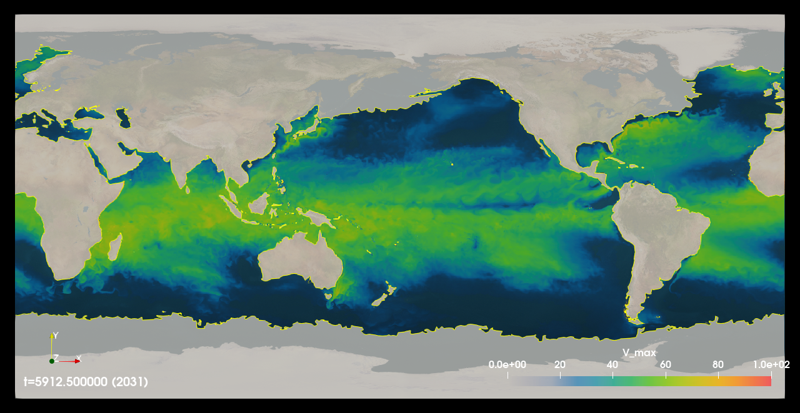

Command Line Applications
=========================
TECA's command line applications deliver the highest perfromance, while
providing a good deal of flexibility for common use cases.  This section
describes how to run TECA's command line applications. If you need more
flexibility or functionality not packaged in a command line application consider
using our Python scripting capabilities.

Running the command line applications requires the environment to be correctly
configured. One should either install to a default location, or load the
appropriate modulefile, for example when using installs on NERSC. Experience
has proven that it is best to start with a clean environment (i.e. no other
modules loaded) and to load the teca modulefiles as late as possible.  For
instance when running in a batch script on the Cray load the teca module in the
batch script rather than in your shell.

+----------------------------------------+--------------------------------------------------+
| **Application**                        | **Description**                                  |
+----------------------------------------+--------------------------------------------------+
| :ref:`teca_metadata_probe`             | A diagnostic tool used for run planning          |
+----------------------------------------+--------------------------------------------------+
| :ref:`teca_integrated_vapor_transport` | Computes IVT (integrated vapor transport)        |
+----------------------------------------+--------------------------------------------------+
| :ref:`teca_integrated_water_vapor`     | Computes IWV (integrated water vapor)            |
+----------------------------------------+--------------------------------------------------+
| :ref:`teca_bayesian_ar_detect`         | AR detection with uncertainty quantification     |
+----------------------------------------+--------------------------------------------------+
| :ref:`teca_deeplab_ar_detect`          | A machine learning based AR detector             |
+----------------------------------------+--------------------------------------------------+
| :ref:`teca_temporal_reduction`         | Computes reductions (min, max, average) over     |
|                                        | the time dimension                               |
+----------------------------------------+--------------------------------------------------+
| :ref:`teca_tc_detect`                  | TC detection using GFDL algorithm                |
+----------------------------------------+--------------------------------------------------+
| :ref:`teca_tc_trajectory`              | Computes TC tracks from a set of candidates      |
+----------------------------------------+--------------------------------------------------+
| :ref:`teca_tc_wind_radii`              | Computes storm size from a set of TC tracks      |
+----------------------------------------+--------------------------------------------------+
| :ref:`teca_potential_intensity`        | Computes thermodynamic potential intensity of    |
|                                        | tropical cyclones                                |
+----------------------------------------+--------------------------------------------------+
| :ref:`teca_tc_stats`                   | Computes descriptive statistics from a set       |
|                                        | of TC tracks                                     |
+----------------------------------------+--------------------------------------------------+
| :ref:`teca_tc_trajectory_scalars`      | Plots tracks on a map along with GFDL            |
|                                        | detectors parameters                             |
+----------------------------------------+--------------------------------------------------+
| :ref:`teca_tc_wind_radii_stats`        | Computes descriptive statistics relating to      |
|                                        | TC storm size                                    |
+----------------------------------------+--------------------------------------------------+
| :ref:`teca_convert_table`              | Convert tabular data from one file format        |
|                                        | to another                                       |
+----------------------------------------+--------------------------------------------------+
| :ref:`teca_event_filter`               | Select TC tracks using run time provided         |
|                                        | expressions                                      |
+----------------------------------------+--------------------------------------------------+
| :ref:`teca_cf_restripe`                | Convert the internal layout of a dataset on disk |
|                                        | with optional subsetting and/or regridding.      |
+----------------------------------------+--------------------------------------------------+

Applying the Command Line Applications at Scale
-----------------------------------------------
In addition to the examples shown below, the TECA_examples_ github repository
contains a number of examples illustrating the application of various command
line tools on large data sets at scale on DOE supercomputers. The examples are
organized by application or task(AR detection, TC detection, etc) then by data
source (eg. CMIP6, CAM5, etc).  These examples include batch scripts used to
probe the dataset to determine run size and the batch scripts used to process
the data as well as any batch scripts used to post-process the results.

.. _TECA_examples: https://github.com/LBL-EESA/TECA_examples

Considerations When Running at NERSC
-------------------------------------
Runtime Environment
~~~~~~~~~~~~~~~~~~~~
The runtime environment must be configured correctly to use TECA. This includes
setting paths such that the versions of dependencies, such as Python and
NetCDF, that TECA was compiled against are found at runtime as well as a number
of other settings.

The TECA_sueprbuild is used to install TECA at NERSC. The process is described
in more detail in :ref:`install_hpc`.  During the install an environment
modules modulefile is generated and installed. Using TECA on NERSC's
Cray systems requires loading the modulefile.

.. code-block:: bash

    module swap PrgEnv-intel PrgEnv-gnu
    module use /global/common/software/m1517/teca/cori/develop/modulefiles
    module load teca

The first line loads the GCC compiler environment and must occur prior to
loading the teca environment module. The second line tells the module system
where to look for the teca modulefile and the third line loads the module,
configuring the environment for use with TECA.

.. _m1517_installs:

m1517 CASCADE installs
~~~~~~~~~~~~~~~~~~~~~~
Members of the CASCADE project m1517 can access rolling installs on Cori and
Perlmutter. These are located on NERSC's common file system. The installs are
grouped by system. For each install group least two installs will be available:
`stable` and `develop`. The `stable` install contains the latest official
release.  See `releases`_ page of the TECA github repo for an up to date list
of releases.  The `develop` install points to a rolling release of TECA with
new as of yet unreleased features and code. The `develop` install is used to
deliver updates to the team on an as needed basis.

The following install groups are located in `/global/common/software/m1517/`:

+-------------------+----------------------------------------------------------+
| **Install group** | **Description**                                          |
+-------------------+----------------------------------------------------------+
| cori              | Installs for NERSC Cori Haswell and KNL CPU partitions   |
+-------------------+----------------------------------------------------------+
| perlmutter_gpu    | Installs for NERSC Perlmutter NVIDIA GPU partition       |
+-------------------+----------------------------------------------------------+
| perlmutter_cpu    | Installs for NERSC Perlmutter Millan Milan CPU partition |
+-------------------+----------------------------------------------------------+

In order to use the `develp` install one would include commands similar to the
following at the top of their batch scripts.

.. code-block:: bash

   module swap PrgEnv-intel PrgEnv-gnu
   module use /global/common/software/m1517/teca/<GROUP>/develop/modulefiles
   module load teca

Where `<GROUP>` is replaced with one of: `cori`, `perlmutter_cpu`, or
`perlmutter_gpu`.  In order to make use of the latest official release install
swap `develop` for `stable` in the second of these commands.

.. _releases: https://github.com/LBL-EESA/TECA/releases

Compute vs Login Nodes
~~~~~~~~~~~~~~~~~~~~~~
The Login nodes are the ones you land on when ssh'ing in while compute nodes
are obtained via slurm commands.  MPI parallel programs cannot be run on the login
nodes, even in serial. When one tries to run a parallel application on a login
node the program will abort in MPI_Init.  Because many of the TECA command line
applications use MPI, one should run them from the compute nodes. For large
runs this should be accomplished by submitting a batch job. For experimentation
and debugging in the shell use the interactive queue.

.. _nersc_file_systems:

File Systems
~~~~~~~~~~~~
NERSC provides the following file systems, knowing their properties is a key
part of successfully making runs at NERSC.

Home ($HOME)
    The home file system is a conventional networked file system. It provides
    the worst performance and should not be used with TECA at all.

Scratch ($SCRATCH)
    The Lustre scratch file system provides the best performance and could be
    used for both TECA installs and the data that will be processed. One caveat
    is that NERSC periodically purges unused files from scratch and an install
    may be damaged or removed completely during the purging process.

Common (/global/common/software/)
    This parallel file system is optimized for software installs. It delivers a
    simlar performance to the scratch file system and is not periodically
    purged. The common file system is a good option for locating an install.
    An effective stratgey for deploying TECA at NERSC is to place installs on
    in common and the data to be processed on scratch.

Project/Community ($CFS)
    The community file system (CFS), formerly know as project, is intended to
    house long lived data shared with the outside world.  The CFS does not
    deliver the best performance and the scratch and/or common file systems
    should be preferred for housing both TECA installs and the data to be
    processed when possible. Note that before launching runs processing data
    stored on CFS `export HDF5_USE_FILE_LOCKING=FALSE`. Not disabling file
    locking on CFS will result in the cryptic NetCDF error `NetCDF: HDF error`.
    The teca environment module handles this setting.

When making runs at NERSC using TECA one should use the scratch file system for
both builds and installs if at all possible. When the data to be processed
resides on CFS file system, disable HDF5 file locking.

Python based code on KNL Nodes
~~~~~~~~~~~~~~~~~~~~~~~~~~~~~~
Importing numpy can abort on KNL nodes, a warning that 272 cores is beyond the
acceptable limit of 256 is displayed before the code exits.  One may work
around this by setting

.. code-block:: bash

    export OPENBLAS_NUM_THREADS=1

This is currently set automatically in the teca environment module file.

KNL vs Haswell Nodes
~~~~~~~~~~~~~~~~~~~~
Some key differences in architectures should be taking into account when
planning runs.  Haswell CPU's have higher clock speeds and greater overall
computational throughput and TECA will run faster there. The Haswell nodes have
2 CPU's per node and hence 2 NUMA domains. For this reason one should tell
slurm to bind MPI ranks to cores. This ensures memory accesses occur within the
local NUMA domain. TECA's threading infrastructure does this by default.  While
the KNL nodes are slower, they have a lower charge factor and jobs over 1024
nodes in the regular queue have a 50% discount. Additionally queue wait times
for KNL nodes are substantially lower than for Haswell nodes. For those reasons
KNL is a great option.

Sizing and Layout of Runs
~~~~~~~~~~~~~~~~~~~~~~~~~
The number of time steps is key for planning a parallel run in TECA
applications that parallelize over time steps. One can use the run time of the
app on a single time step in conjunction with number of time steps per MPI rank
in the job to estimate the run time at a given concurrency level. One then
selects the concurrency level based on the run time and, queue wait times, etc.
See :ref:`teca_metadata_probe` for information on determining the number of
time steps and available arrays.

TECA will automatically make use of threads for on node parallelism if there
are more physical cores available than there are MPI ranks in use. In order to
take advantage of this one needs to spread the MPI ranks out on the set of
compute nodes in use such that there are fewer MPI ranks than physical CPU
cores. This is done through the combination of *-n* and *-N* srun options.
Little n tells the total number of MPI ranks to use, and big N tells how many
nodes in total to spread them across.  :math:`(number of nodes) * (physical
cores per node) > (total number of MPI ranks)` Haswell nodes have 32 physical
cores per node while KNL nodes have 68 physical cores per node.

TECA makes use of threads and OpenMP for parallelism on CPU based systems. When
there are fewer MPI ranks per node than there are physical cores per node (32
on Haswell/68 on KNL) TECA will size internal thread pools such that each
thread is bound to a unique physical core while accounting for all thread pools
on the node. This has been determined to be the most performant strategy.  One
should avoid the use of the `-c` and `--bind-cores` srun options unless one
fully understands the implications as improper settings can substantially
degrade performance.

Common Command Line Options
---------------------------
The command line applications have been designed so that the specification input
datasets, output datasets, and common execution control options are the same
where ever possible. Details of the common options and controls are presented
in this section in more detail.

Getting Help
~~~~~~~~~~~~
All command line applications support the following options for displaying
application specific command line option documentation in the shell.

--help
    Display the basic options help. Basic options are the ones that will be
    most commonly used with the application. In most cases using just the basic
    options will suffice.

--advanced_help
    Display the advanced options help. All of the settable properties of the
    individual pipeline stages used in the application can be accessed via the
    advanced options. Each stage is given a name that is used to prefix its
    options. In that way multiple stages of the same type can be differentiated.
    Through this mechanism all available control parameters are exposed to the
    user.

--full_help
    Display both the basic and the advanced options help.

Specifying Input NetCDF Datasets
~~~~~~~~~~~~~~~~~~~~~~~~~~~~~~~~~
For applications that process mesh based data in NetCDF format there are two
command line options for specifying input data to process.

--input_file arg
    a *teca_multi_cf_reader* configuration file identifying the set of NetCDF CF2
    files to process.  When present data is read using the
    teca_multi_cf_reader. Use one of either *--input_file* or *--input_regex*.

--input_regex arg
    a *teca_cf_reader* regex identifying the set of NetCDF CF2 files to process.
    When present data is read using the teca_cf_reader. Use one of either
    *--input_file* or *--input_regex*.

Note that both of these options make use of regular expressions to identify a
set of files to process. Regular expressions provide a compact mechanism for
specifying a large set of files. Furthermore they can be used to subset the
files based on the contents of the file names. Subsetting in this way enables
one to process time ranges.

Regular Expressions
^^^^^^^^^^^^^^^^^^^^
Regular expressions are used by the *teca_wrf_reader*, *teca_cf_reader* and
*teca_multi_cf_reader* to identify and select all or a subset of a NetCDF
dataset to read and process.

Regular expressions look like the more familiar shell glob, but are
much more powerful and the special characters have different meanings.
Here are the basics:

+---------------+------------------------------------------------------------------+
| **Character** | **Description**                                                  |
+---------------+------------------------------------------------------------------+
| .             | wild card, matches any character                                 |
+---------------+------------------------------------------------------------------+
| \*            | repeat the previous character zero or more times                 |
+---------------+------------------------------------------------------------------+
| []            | match any character in the brackets. For example [0-9] matches   |
|               | a single digit number zero through nine. [A-Z] matches a single  |
|               | capital letter, while [xzy] matches a single x,y, or z           |
+---------------+------------------------------------------------------------------+
| ^             | If used as the first character in a [] list, it negates the      |
|               | list. Otherwise, this is an anchor matching the beginning of     |
|               | the string.                                                      |
+---------------+------------------------------------------------------------------+
| \\            | Escapes the next character. This is critical for specifying      |
|               | file names, the . separating the file from the extension needs   |
|               | to be escaped.                                                   |
+---------------+------------------------------------------------------------------+
| $             | matches the end of the string.                                   |
+---------------+------------------------------------------------------------------+

Because shell globs uses some of the same control characters, when a regex
is issued in a shell the characters must be quoted or escaped to keep the
shell from expanding them. Single quotes are the most effective since they
prevent the shell from processing the quoted text. Alternatively backslashes
may be used to escape characters individually.

Another difference between shell globbing and regular expressions is that
regular expressions can partially match. Use of anchors ^ and $
can help, even so care is required to avoid picking up files inadvertently.

An example of an input regex which includes all .nc files is: '.\*\\.nc\$'. If
instead one wanted to grab only files from 2004-2005 then
'.\*\\.200[45].*\\.nc\$' would do the trick. For the best performance, specify
the smallest set of files needed to achieve the desired result. Each of the
files will be opened in order to scan the time axis.

TECA makes use of POSIX Basic Regular Expressions, more information can be found
`here <https://pubs.opengroup.org/onlinepubs/9699919799/basedefs/V1_chap09.html#tag_09>`_.

MCF Reader Configuration Files
^^^^^^^^^^^^^^^^^^^^^^^^^^^^^^
When data from the same dataset resides in different directories MCF
configuration files are used to configure the readers.

The configuration file consists of *name = value* pairs and *flags* organized
in sections. Sections are declared using brackets []. There is an optional
opening global section that comes first followed by one or more `[cf_reader]`
sections.

The following example from the HighResMIP dataset MCF configures the reader to
read the variables *hus*, *ua* and *va* each from a different subdirectory.

.. _HighResMIPMCF:

.. code-block:: ini

    # TECA multi cf reader config
    # Fri Nov  6 09:24:17 PST 2020

    data_root = /global/cfs/cdirs/m3522/cmip6/CMIP6_hrmcol/HighResMIP/CMIP6/HighResMIP/ECMWF/ECMWF-IFS-HR/highresSST-present/r1i1p1f1/6hrPlevPt
    regex = 6hrPlevPt_ECMWF-IFS-HR_highresSST-present_r1i1p1f1_gr_199[0-9].*\.nc$

    z_axis_variable = plev

    [cf_reader]
    variables = hus
    regex = %data_root%/hus/gr/v20170915/hus_%regex%
    provides_time
    provides_geometry

    [cf_reader]
    variables = ua
    regex = %data_root%/ua/gr/v20170915/ua_%regex%

    [cf_reader]
    variables = va
    regex = %data_root%/va/gr/v20170915/va_%regex%

The global section may contain `data_root` and `regex` name-value pairs.
Occurrences of the strings `%data_root%` and `%regex%` in the `regex` name-value
pairs found in following `[cf_reader]` sections are replaced with the values of
the globals.  The following global section key words are supported:

+-----------------------+-----------------------------------------------------+
| key word              | description                                         |
+=======================+=====================================================+
| data_root             | Can be used to hold the common part of the path     |
|                       | to data files. Optional. Occurrences of             |
|                       | %data_root% found in the regex specification will   |
|                       | be replaced with this value.                        |
+-----------------------+-----------------------------------------------------+
| regex                 | Can be used to hold the common part of the          |
|                       | regular expression. Optional. Occurrences of        |
|                       | %data_root% found in the regex specification will   |
|                       | be replaced with this value.                        |
+-----------------------+-----------------------------------------------------+

Each `[cf_reader]` section consists of a `name`(optional), a `regex`,
a list of `variables`, a `provides_time` flag(optional) and a
`provides_geometry` flag(optional). At least one section must contain a
`provides_time` and `provides geometry` flag.  The following are `[cf_reader]`
section key words:

+-----------------------+-----------------------------------------------------+
| key word              | description                                         |
+=======================+=====================================================+
| name                  | An optional name for the reader. This is used to    |
|                       | set advanced command line options.                  |
+-----------------------+-----------------------------------------------------+
| regex                 | A regular expression identifying a set of files.    |
+-----------------------+-----------------------------------------------------+
| variables             | A comma separated list of variables to serve from   |
|                       | this reader. Variables not in the list are          |
|                       | ignored.                                            |
+-----------------------+-----------------------------------------------------+
| provides_time         | A flag, the presence of which indicates that this   |
|                       | reader will provide the time axis.                  |
+-----------------------+-----------------------------------------------------+
| provides_geometry     | A flag the presence of which indicates that this    |
|                       | reader will provide the mesh definition.            |
+-----------------------+-----------------------------------------------------+

A number of optional `teca_cf_reader` properties may be placed in either the
global or individual sections. When not specified in the MCF file the default
values defined by the `teca_cf_reader` are used. Such properties, when
specified in the global section are applied to all readers. Properties
specified with in a `[cf_reader]` section are applied only to the reader
declared in that section. When the same property is specified in both the
global section and a `[cf_reader]` section, the property specified in the
`[cf_reader]` section takes precedence. The following `teca_cf_reader`
properties are supported:

+-------------------------+---------------------------------------------------+
| key word                | description                                       |
+=========================+===================================================+
| x_axis_variable         | The name of the variable defining the x           |
|                         | coordinate axis. The default is *lon*.            |
+-------------------------+---------------------------------------------------+
| y_axis_variable         | The name of the variable defining the y           |
|                         | coordinate axis. The default is *lat*.            |
+-------------------------+---------------------------------------------------+
| z_axis_variable         | The name of the variable defining the z           |
|                         | coordinate axis. The default is *""*. The         |
|                         | *z_axis_variable* must be specified for 3D data.  |
+-------------------------+---------------------------------------------------+
| t_axis_variable         | The name of the variable defining the time axis.  |
|                         | The default is *time*.                            |
+-------------------------+---------------------------------------------------+
| calendar                | The calendar to use with the time axis. The       |
|                         | calendar is typically encoded in the file. The    |
|                         | value provided here can be used to override what  |
|                         | is in the file or to specify the calendar when it |
|                         | is missing from the file.                         |
+-------------------------+---------------------------------------------------+
| t_units                 | The units that the time axis is in.  This time    |
|                         | units are typically encoded in the file. The      |
|                         | value provided here can be used to overrides what |
|                         | is in the file or to specify the time units when  |
|                         | they are missing from the file.                   |
+-------------------------+---------------------------------------------------+
| filename_time_template  | Provides a way to infer time from the filename if |
|                         | the time axis is not stored in the file itself.   |
|                         | *strftime* format codes are used. For example for |
|                         | the files: *my_file_20170516_00.nc*,              |
|                         | *my_file_20170516_03.nc*, *...*; the template     |
|                         | would be *my_file_%Y%m%d_%H.nc*                   |
+-------------------------+---------------------------------------------------+
| periodic_in_x           | A flag that indicates a periodic boundary in the  |
|                         | x direction.                                      |
+-------------------------+---------------------------------------------------+
| clamp_dimensions_of_one | If set the requested extent will be clamped in a  |
|                         | given direction if the coordinate axis in that    |
|                         | direction has a length of 1 and the requested     |
|                         | extent would be out of bounds. This is a work     |
|                         | around to enable loading 2D data with a vertical  |
|                         | dimension of 1, into a 3D mesh and should be used |
|                         | with caution.                                     |
+-------------------------+---------------------------------------------------+
| target_bounds           | An optional axis aligned bounding box specified   |
|                         | as a 6-tuple in the order [x0, x1, y0, y1, z0,    |
|                         | z1] that defines a transform to apply to the      |
|                         | mesh coordinate axes. If any of the axis          |
|                         | directions are set to [1, 0] then no transform is |
|                         | applied in that direction.                        |
+-------------------------+---------------------------------------------------+
| target_x_axis_variable  | The name of the transformed x axis variable. If   |
|                         | not specified then the name is passed through.    |
+-------------------------+---------------------------------------------------+
| target_y_axis_variable  | The name of the transformed y axis variable. If   |
|                         | not specified then the name is passed through.    |
+-------------------------+---------------------------------------------------+
| target_z_axis_variable  | The name of the transformed z axis variable. If   |
|                         | not specified then the name is passed through.    |
+-------------------------+---------------------------------------------------+
| target_x_axis_units     | The units of the transformed x axis units. If     |
|                         | not specified then the units are passed through.  |
+-------------------------+---------------------------------------------------+
| target_y_axis_units     | The units of the transformed y axis units. If     |
|                         | not specified then the units are passed through.  |
+-------------------------+---------------------------------------------------+
| target_z_axis_units     | The units of the transformed z axis units. If     |
|                         | not specified then the units are passed through.  |
+-------------------------+---------------------------------------------------+

.. _rearranging_data:

Rearranging Input Data
^^^^^^^^^^^^^^^^^^^^^^
When the data to be processed is organized on disk such that can't easily be
selected using the regex mechanism described above, one possible solution is
to use a shell script to create a set of symbolic links pointing to the
original data that is.

For instance the following shell script was used to rearrange an ERA5 dataset
that was stored on disk such that each month of data exists in a unique folder.
The folders were named by an integer with 4 digits encoding the year and 2
digits encoding the month, `YYYYMM`.

.. code-block:: bash

    mkdir CMIP6_ERA5_e5_oper_an_sfc/
    for d in `ls --color=never /global/cfs/cdirs/m3522/cmip6/ERA5/e5.oper.an.sfc`
    do
        f=/global/cfs/cdirs/m3522/cmip6/ERA5/e5.oper.an.sfc/${d}/e5.oper.an.sfc.128_137_tcwv.*.nc
        ln -s ${f} CMIP6_ERA5_e5_oper_an_sfc/
    done

The `ln` command creates a symbolic link to the file passed as its first
argument at the location passed as its second argument. See also
:ref:`mdp_era5` and :ref:`ta_era5`.

Overriding the Time Axis
~~~~~~~~~~~~~~~~~~~~~~~~
In cases where it is necessary to override the time axis or manually specify
values, the following teca_cf_reader options can be used.

--cf_reader::t_axis_variable arg
  The name of variable that has time axis coordinates (time). Set to an empty
  string to enable override methods (--filename_time_template, --t_values) or
  to disable time coordinates completely

--cf_reader::calendar arg
  An optional calendar override. May be one of: standard, Julian,
  proplectic_Julian, Gregorian, proplectic_Gregorian, Gregorian_Y0,
  proplectic_Gregorian_Y0, noleap, no_leap, 365_day, 360_day. When the
  override is provided it takes precedence over the value found in the file.
  Otherwise the calendar is expected to be encoded in the data files using
  CF2 conventions.

--cf_reader::t_units arg
  An optional CF2 time units specification override declaring the units of
  the time axis and a reference date and time from which the time values are
  relative to. If this is provided it takes precedence over the value found
  in the file. Otherwise the time units are expected to be encoded in the
  files using the CF2 conventions

--cf_reader::filename_time_template arg
  An optional std::get_time template string for decoding time from the input
  file names. If no calendar is specified the standard calendar is used. If
  no units are specified then "days since %Y-%m-%d 00:00:00" where Y,m,d are
  determined from the filename of the first file. Set t_axis_variable to an
  empty string to use.

--cf_reader::t_values arg
  An optional explicit list of double precision values to use as the time
  axis. If provided these take precedence over the values found in the files.
  Otherwise the variable pointed to by the t_axis_variable provides the time
  values. Set t_axis_variable to an empty string to use.

The Overrides, *--filename_time_template* and *t_values* are activated by
setting *--t_axis_variable* to an empty string "". When decoding the time
axis from file names, a template must be provided that matches the filenames.
For instance a template for the files: my_file_20170516_00.nc,
my_file_20170516_03.nc, ... might be my_file_%Y%m%d_%H.nc.

Subsetting in the Time Dimension
~~~~~~~~~~~~~~~~~~~~~~~~~~~~~~~~
A simple way of subsetting the time dimension is by using a suitable regex
when specifying the input dataset. This section describes options that will
subset withing the data identified by the regular expression.

The following two command line options let one subset by time step. This is the
most efficient way to subset the time dimension. However, Use of these
options requires one to know the mapping between steps and times. In some cases
this is easy to calculate. For instance when there is a file per day of data.

--first_step arg
    The first time step to process

--last_step arg
    The last time step to process

When it is not easy to determine the mapping between time steps and time the
following command line options use TECA's calendaring capabilities to select a
subset of data occurring between two dates provided in a human readable form.

--start_date arg
    The first time to process in 'Y-M-D h:m:s' format

--end_date arg
    The last time to process in 'Y-M-D h:m:s' format

The accepted format is a human readable date spec such as `YYYY-MM-DD hh:mm:ss`.
Because of the space in between day and hour spec quotes must be used. For
example "2005-01-01 00:00:00". Specifying start and end dates are optional. If
only *--start_date* is given then the steps from that date on are included,
while if only *--end-date* is given steps up to an including that date are
included.  if neither *--start-date* nor *--end-date* are given then all of
the time steps in all of the files specified are processed.

Specifying Mesh Dimensions
~~~~~~~~~~~~~~~~~~~~~~~~~~
TECA identifies mesh coordinate axes using the names *lon* and *lat*. One can
override these and make another variable provide the coordinate axes.

Unless an application is intrinsically 3D (eg. a vertical integral) by default
the mesh is assumed to be 2D. To tell the reader to generate a 3D mesh
set the z-axis variable name.

--x_axis_variable arg
    name of x coordinate variable (lon)

--y_axis_variable arg
    name of y coordinate variable (lat)

--z_axis_variable arg
    name of z coordinate variable (). When processing 3D set this to the
    variable containing the vertical coordinates. When empty the data will be
    treated as 2D.

Writing Results To Disk
~~~~~~~~~~~~~~~~~~~~~~~

Mesh Based Data in NetCDF CF2 Format
^^^^^^^^^^^^^^^^^^^^^^^^^^^^^^^^^^^^
The following options control file name and layout when writing mesh based data
in NetCDF CF2 format.

--output_file arg
    file pattern for output netcdf files (%t% is the time index)

--file_layout arg (=monthly)
    Selects the size and layout of the set of output files. May be one of *number_of_steps*, *daily*,
    *monthly*, *seasonal*, or *yearly*. Files are structured such that each file contains one of the
    selected interval. For the number_of_steps option use `--steps_per_file`.

--steps_per_file arg
    The number of time steps per output file when `--file_layout number_of_steps` is specified.

--cf_writer::date_format arg
    A strftime format used when encoding dates into the output
    file names (%F-%HZ)")

Tabular Data
^^^^^^^^^^^^
Data such as TC tracks is stored in tabular format. The table writer will
select the format based on the output file extension. This can be one of:
*.csv*, *.bin*, or *.nc*.  The *.bin* and *.nc* format are organized by columns
while the *.csv* format is organized by rows. The :ref:`teca_convert_table`
command line application converts from one format to the other and TECA's
Python bindings can be used to write post processing scripts.

.. _teca_metadata_probe:

teca_metadata_probe
------------------------------------
The metadata probe is a command line application that presents how TECA sees
input dataset to the user in a textual format. The primary use of the metadata
probe is: planning runs by getting the number of time steps selected by a date
range or regular expression; validating regular expression or MCF (multi-cf)
configuration files; determining which variables are in the files and what are
their shapes and dimensions.

Inputs
~~~~~~
A 2 or 3D time dependent mesh in NetCDF CF2 format

Outputs
~~~~~~~
#. The number of time steps found in the files selected by the regex and/or start and end date
#. The calendar and simulated time range selected by the regex and/or start/end date
#. The mesh dimensionality. The default is 2D , for 3D data use the `--z_axis_variable` command line option.
#. A list of the available arrays and their dimensions and shapes.

Command Line Arguments
~~~~~~~~~~~~~~~~~~~~~~

--input_file arg
    a teca_multi_cf_reader configuration file identifying the set of NetCDF CF2 files to process.
    When present data is read using the teca_multi_cf_reader. Use one of either `--input_file` or
    `--input_regex`.

--input_regex arg
    a teca_cf_reader regex identyifying the set of NetCDF CF2 files to process. When present data
    is read using the teca_cf_reader. Use one of either `--input_file` or `--input_regex`.

--x_axis_variable arg (=lon)
    name of x coordinate variable

--y_axis_variable arg (=lat)
    name of y coordinate variable

--z_axis_variable arg
    name of z coordinate variable. When processing 3D set this to the variable containing vertical
    coordinates. When empty the data will be treated as 2D.

--start_date arg
    The first time to process in 'Y-M-D h:m:s' format. Note: There must be a space between the date
    and time specification

--end_date arg
    The last time to process in 'Y-M-D h:m:s' format

--help
    displays documentation for application specific command line options

--advanced_help
    displays documentation for algorithm specific command line options

--full_help
    displays both basic and advanced documentation together

Examples
~~~~~~~~

.. _mdp_highresmip:

CMIP6 data
^^^^^^^^^^
In this example the metadata_probe examines data from the HighResMIP collection.
The data is organized such that the data files for each variable reside in their
own directory. In this case we use the :ref:`MCF file<HighResMIPMCF>`.

.. code-block:: bash

    $ salloc -N 17 -C knl -q interactive -t 01:00:00

    $ module swap PrgEnv-intel PrgEnv-gnu
    $ module use /global/common/software/m1517/teca/cori/develop/modulefiles
    $ module load teca

    $ time srun -N 17 -n 1024 teca_metadata_probe --z_axis_variable plev \
        --input_file HighResMIP_ECMWF_ECMWF-IFS-HR_highresSST-present_r1i1p1f1_6hrPlevPt.mcf

    WARNING: [0:46912496725888] [/global/cscratch1/sd/loring/teca_testing/TECA_superbuild/build-cf-reader/TECA-prefix/src/TECA/io/teca_cf_reader.cxx:623 TECA-BARD-v1.0.1-222-ge294c25]
    WARNING: File 528 "hus_6hrPlevPt_ECMWF-IFS-HR_highresSST-present_r1i1p1f1_gr_199401010000-199401311800.nc" units "days since 1994-1-1 00:00:00" differs from base units "days since 1950-1-1 00:00:00" a conversion will be made.
    WARNING: [0:46912496725888] [/global/cscratch1/sd/loring/teca_testing/TECA_superbuild/build-cf-reader/TECA-prefix/src/TECA/io/teca_cf_reader.cxx:623 TECA-BARD-v1.0.1-222-ge294c25]
    WARNING: File 529 "hus_6hrPlevPt_ECMWF-IFS-HR_highresSST-present_r1i1p1f1_gr_199402010000-199402281800.nc" units "days since 1994-1-1 00:00:00" differs from base units "days since 1950-1-1 00:00:00" a conversion will be made.
    #
    # many simlar warning messages omitted...
    #
    WARNING: [0:46912496725888] [/global/cscratch1/sd/loring/teca_testing/TECA_superbuild/build-cf-reader/TECA-prefix/src/TECA/io/teca_cf_reader.cxx:623 TECA-BARD-v1.0.1-222-ge294c25]
    WARNING: File 779 "va_6hrPlevPt_ECMWF-IFS-HR_highresSST-present_r1i1p1f1_gr_201412010000-201412311800.nc" units "days since 1994-1-1 00:00:00" differs from base units "days since 1950-1-1 00:00:00" a conversion will be made.

    A total of 94964 steps available. Using the gregorian calendar. Times are specified
    in units of days since 1950-1-1 00:00:00. The available times range from 1950-1-1
    0:0:0 (0) to 2014-12-31 18:0:0 (23740.8).

    Mesh dimension: 3D
    Mesh coordinates: lon, lat, plev

    7 data arrays available

      Id   Name    Type         Dimensions                Shape
    -----------------------------------------------------------------------
      1    hus     NC_FLOAT     [time, plev, lat, lon]    [94964, 7, 361, 720]
      2    lat     NC_DOUBLE    [lat]                     [361]
      3    lon     NC_DOUBLE    [lon]                     [720]
      4    plev    NC_DOUBLE    [plev]                    [7]
      5    time    NC_DOUBLE    [time]                    [94964]
      6    ua      NC_FLOAT     [time, plev, lat, lon]    [94964, 7, 361, 720]
      7    va      NC_FLOAT     [time, plev, lat, lon]    [94964, 7, 361, 720]

    real	1m23.011s
    user	0m0.451s
    sys	0m0.469s

There are 94964 time steps in this 3D dataset. The maximum MPI concurrency for
this dataset is 94964 MPI ranks. Using fewer MPI ranks will result in some or
all ranks processing multiple time steps. A number of warnings were printed as
the probe ran because the reader detected that the calendar and/or time units
were inconsistent in some of the files. In this case the reader made a
conversion such that all of the data is presented to the down stream stages
in the same calendar and units.

.. _mdp_artmip:

ARTMIP MERRA data
^^^^^^^^^^^^^^^^^
This example shows how to configure the reader for extracting the time axis
from the file names.  In this example dataset was organized such that the data
from each simulated year was stored in its own folder. Each time step was stored
in a file, no time information was stored in the file itself. Instead, the date
and time was encoded in the file name.

.. code-block:: bash

    $ salloc -N 10 -C knl -q interactive -t 01:00:00

    $ module swap PrgEnv-intel PrgEnv-gnu
    $ module use /global/common/software/m1517/teca/cori/develop/modulefiles
    $ module load teca

    $ year=1980
    $ data_dir=/global/project/projectdirs/m1517/cascade/external_datasets/ARTMIP/MERRA_2D/${year}
    $ regex='ARTMIP_MERRA_2D_.*\.nc'

    $ time srun -n 680 -N 10 teca_metadata_probe \
        --input_regex "${data_dir}/${regex}" --cf_reader::t_axis_variable '' \
        --cf_reader::filename_time_template ARTMIP_MERRA_2D_%Y%m%d_%H.nc

    STATUS: [0:46912496725888] [/global/cscratch1/sd/loring/teca_testing/TECA_superbuild/build-cf-reader/TECA-prefix/src/TECA/io/teca_cf_reader.cxx:823 TECA-BARD-v1.0.1-222-ge294c25]
    STATUS: The time axis will be infered from file names using the user provided template "ARTMIP_MERRA_2D_%Y%m%d_%H.nc" with the "standard" calendar in units "days since 1980-01-01 00:00:00"

    A total of 2928 steps available in 2928 files. Using the standard calendar.
    Times are specified in units of days since 1980-01-01 00:00:00. The available
    times range from 1980-1-1 0:0:0 (0) to 1980-12-31 21:0:0 (365.875).

    Mesh dimension: 2D
    Mesh coordinates: lon, lat

    7 data arrays available

      Id   Name    Type         Dimensions    Shape
    -------------------------------------------------
      1    IVT     NC_FLOAT     [lat, lon]    [361, 576]
      2    IWV     NC_FLOAT     [lat, lon]    [361, 576]
      3    PS      NC_FLOAT     [lat, lon]    [361, 576]
      4    lat     NC_DOUBLE    [lat]         [361]
      5    lon     NC_DOUBLE    [lon]         [576]
      7    uIVT    NC_FLOAT     [lat, lon]    [361, 576]
      8    vIVT    NC_FLOAT     [lat, lon]    [361, 576]

    real	0m13.980s
    user	0m0.307s
    sys	0m0.240s

The output shows that there were 2928 time steps in this year. The maximum level
of concurrency one could exploit in processing this dataset is 2928 MPI ranks.
Running with fewer than 2928 MPI ranks will result in some or all ranks processing
multiple time steps.

.. _mdp_cam5:

CAM5 data
^^^^^^^^^
In the following example the metadata probe is used
to determine the number of time steps in a large CAM5 dataset spread over many files.

.. code-block:: bash

    $data_dir=/global/cscratch1/sd/mwehner/machine_learning_climate_data/All-Hist/CAM5-1-0.25degree_All-Hist_est1_v3_run1/h2
    $srun -N 17 -n 1024 ./bin/teca_metadata_probe --input_regex=${data_dir}/'.*\.nc$'

    A total of 58400 steps available in 7300 files. Using the noleap calendar.
    Times are specified in units of days since 1995-02-01 00:00:00. The available
    times range from 1996-1-1 0:0:0 (334) to 2015-12-31 21:0:0 (7633.88).

    Mesh dimension: 2D
    Mesh coordinates: lon, lat

    45 data arrays available

      Id    Name            Type         Dimensions          Shape
    -----------------------------------------------------------------------

      1     PRECT           NC_FLOAT     [time, lat, lon]    [58400, 768, 1152]
      2     PS              NC_FLOAT     [time, lat, lon]    [58400, 768, 1152]
      3     PSL             NC_FLOAT     [time, lat, lon]    [58400, 768, 1152]
      4     QREFHT          NC_FLOAT     [time, lat, lon]    [58400, 768, 1152]
      5     T200            NC_FLOAT     [time, lat, lon]    [58400, 768, 1152]
      6     T500            NC_FLOAT     [time, lat, lon]    [58400, 768, 1152]
      7     TMQ             NC_FLOAT     [time, lat, lon]    [58400, 768, 1152]
      8     TREFHT          NC_FLOAT     [time, lat, lon]    [58400, 768, 1152]
      9     TS              NC_FLOAT     [time, lat, lon]    [58400, 768, 1152]
      10    U850            NC_FLOAT     [time, lat, lon]    [58400, 768, 1152]
      11    UBOT            NC_FLOAT     [time, lat, lon]    [58400, 768, 1152]
      12    V850            NC_FLOAT     [time, lat, lon]    [58400, 768, 1152]
      13    VBOT            NC_FLOAT     [time, lat, lon]    [58400, 768, 1152]
      14    Z1000           NC_FLOAT     [time, lat, lon]    [58400, 768, 1152]
      15    Z200            NC_FLOAT     [time, lat, lon]    [58400, 768, 1152]
      16    ZBOT            NC_FLOAT     [time, lat, lon]    [58400, 768, 1152]
      17    ch4vmr          NC_DOUBLE    [time]              [58400]
      18    co2vmr          NC_DOUBLE    [time]              [58400]
      19    date            NC_INT       [time]              [58400]
      20    date_written    NC_BYTE      [time, chars]       [58400, 8]
      21    datesec         NC_INT       [time]              [58400]
      22    f11vmr          NC_DOUBLE    [time]              [58400]
      23    f12vmr          NC_DOUBLE    [time]              [58400]
      24    gw              NC_DOUBLE    [lat]               [768]
      25    hyai            NC_DOUBLE    [ilev]              [31]
      26    hyam            NC_DOUBLE    [lev]               [30]
      27    hybi            NC_DOUBLE    [ilev]              [31]
      28    hybm            NC_DOUBLE    [lev]               [30]
      29    ilev            NC_DOUBLE    [ilev]              [31]
      30    lat             NC_DOUBLE    [lat]               [768]
      31    lev             NC_DOUBLE    [lev]               [30]
      32    lon             NC_DOUBLE    [lon]               [1152]
      33    n2ovmr          NC_DOUBLE    [time]              [58400]
      34    ndcur           NC_INT       [time]              [58400]
      35    nlon            NC_INT       [lat]               [768]
      36    nscur           NC_INT       [time]              [58400]
      37    nsteph          NC_INT       [time]              [58400]
      38    slat            NC_DOUBLE    [slat]              [767]
      39    slon            NC_DOUBLE    [slon]              [1152]
      40    sol_tsi         NC_DOUBLE    [time]              [58400]
      41    time            NC_DOUBLE    [time]              [58400]
      42    time_bnds       NC_DOUBLE    [time, nbnd]        [58400, 2]
      43    time_written    NC_BYTE      [time, chars]       [58400, 8]
      44    w_stag          NC_DOUBLE    [slat]              [767]
      45    wnummax         NC_INT       [lat]               [768]

In this example the dataset is quite large comprised of 7300 files. Each file has
456MB of data for a total aggregate size of over 3TB. In this case it is necessary
to run the metadata probe using MPI in order for the probe to complete in a
reasonable amount of time. A serial run of the  probe on this dataset took over
71 minutes while the parallel run shown above took about 47 seconds. Note that because this
dataset has a large number of files it is an extreme case, for datasets with on the order
of a few hundred files a serial or small MPI parallel run should work well.

.. _mdp_era5:

ERA5 data
^^^^^^^^^^
In the following example the metadata probe is used to determine the contents of a
an ERA5 dataset spanning 41 years of simulated time at quarter degree, 1 hourly resolution.

.. code-block:: bash

    time srun -n 247 teca_metadata_probe \
        --input_regex ./CMIP6_ERA5_e5_oper_an_sfc/'.*\.nc$' \
        --x_axis_variable longitude --y_axis_variable latitude

    A total of 360840 steps available in 494 files. Using the gregorian calendar.
    Times are specified in units of hours since 1900-01-01 00:00:00. The available
    times range from 1979-1-1 0:0:0 (692496) to 2020-2-29 22:59:60 (1.05334e+06).

    Mesh dimension: 2D
    Mesh coordinates: longitude, latitude

    5 data arrays available

      Id   Name         Type         Dimensions                     Shape
    --------------------------------------------------------------------------------
      1    TCWV         NC_FLOAT     [time, latitude, longitude]    [360840, 721, 1440]
      2    latitude     NC_DOUBLE    [latitude]                     [721]
      3    longitude    NC_DOUBLE    [longitude]                    [1440]
      4    time         NC_INT       [time]                         [360840]
      5    utc_date     NC_INT       [time]                         [360840]

This dataset was stored on disk arranged such that each month of data exists in
a unique folder. The folders are named by a 6 digit integer, `YYYYMM`, with 4
digits encoding the year and 2 digits encoding the month. Prior to applying the
metadata probe a set of symlinks were created so that all of the files of
interest were collocated in a single folder making them easy to select with a
simple regex. See :ref:`rearranging_data` for information on creating symlinks.

.. _teca_bayesian_ar_detect:

teca_bayesian_ar_detect
--------------------------------------
The Bayesian AR detection (BARD) application is an MPI+threads parallel
code that applies an uncertainty inference on a range of input fields, mainly
Integrated Vapor Transport (IVT) and Integrated Water Vapor (IWV).
We use a Bayesian framework to sample from the set of AR detector parameters
that yield AR counts similar to the expert database of AR counts; this yields
a set of plausible AR detectors from which we can assess quantitative uncertainty.
TECA-BARD is described in :cite:`teca_bard`.

    Pseudocoloring of precipitable water with superposed 5%, 50%, and 100%
    contours of AR probability. Green x shows ground truth obtained via
    manual expert identification.

Inputs
~~~~~~
A 3D time dependent mesh in NetCDF CF2 format with:

1. horizontal wind velocity vector
2. specific humidity

Or a 2D time dependent mesh with:

1. IVT magnitude

Outputs
~~~~~~~
A 2D mesh with:

1. AR probability
2. A segmentation of AR probability

If IVT was computed from horizontal wind and specific humidity

1. IVT vector
2. IVT magnitude

Command Line Arguments
~~~~~~~~~~~~~~~~~~~~~~

--input_file arg
    a teca_multi_cf_reader configuration file identifying the set of NetCDF CF2 files to process.
    When present data is read using the teca_multi_cf_reader. Use one of either `--input_file` or
    `--input_regex`.

--input_regex arg
    a teca_cf_reader regex identifying the set of NetCDF CF2 files to process. When present data is
    read using the teca_cf_reader. Use one of either `--input_file` or `--input_regex`.

--ivt arg (=IVT)
    name of variable with the magnitude of integrated vapor transport

--compute_ivt_magnitude
    when this flag is present magnitude of vector IVT is calculated. use `--ivt_u` and `--ivt_v` to set
    the name of the IVT vector components if needed.

--ivt_u arg (=IVT_U)
    name of variable with longitudinal component of the integrated vapor transport vector.

--ivt_v arg (=IVT_V)
    name of variable with latitudinal component of the integrated vapor transport vector.

--write_ivt_magnitude
    when this flag is present IVT magnitude is written to disk with the AR detector results

--compute_ivt
    when this flag is present IVT vector is calculated from specific humidity, and wind vector
    components. use `--specific_humidity` `--wind_u` and `--wind_v` to set the name of the specific
    humidity and wind vector components, and `--ivt_u` and `--ivt_v` to control the names of the
    results, if needed.

--specific_humidity arg (=Q)
    name of variable with the 3D specific humidity field.(Q)

--wind_u arg (=U)
    name of variable with the 3D longitudinal component of the wind vector.

--wind_v arg (=V)
    name of variable with the 3D latitudinal component of the wind vector.

--write_ivt
    when this flag is present IVT vector is written to disk with the result

--dem arg
    A teca_cf_reader regex identifying the file containing surface elevation field or DEM.

--dem_variable arg (=Z)
    Sets the name of the variable containing the surface elevation field

--mesh_height arg (=Zg)
    Sets the name of the variable containing the point wise vertical height in meters above mean
    sea level

--ar_probability arg (=ar_probability)
    Sets the name of the variable to store the computed AR probability mask in.

--ar_weighted_variables arg
    An optional list of variables to weight with the computed AR probability. Each such variable
    will be multiplied by the computed AR probability, and written to disk as "NAME_ar_wgtd".

--x_axis_variable arg (=lon)
    name of x coordinate variable

--y_axis_variable arg (=lat)
    name of y coordinate variable

--z_axis_variable arg (=plev)
    name of z coordinate variable

--periodic_in_x arg (=1)
    Flags whether the x dimension (typically longitude) is periodic.

--segment_ar_probability
    A flag that enables a binary segmentation of AR probability to be produced. `--segment_threshold`
    controls the segmentation. threshold and `--segment_variable` to set the name of the variable to
    store the result in.

--segment_threshold arg (=0.667)
    Sets the threshold value that is used when segmenting ar_probability. See also
    `--segment_ar_probability`

--segment_variable arg (=ar_binary_tag)
    Set the name of the variable to store the result of a binary segmentation of AR probabilty. See
    also `--segment_ar_probability`.

--output_file arg (=TECA_BARD_%t%.nc)
    A path and file name pattern for the output NetCDF files. %t% is replaced with a human readable
    date and time corresponding to the time of the first time step in the file. Use
    `--cf_writer::date_format` to change the formatting

--file_layout arg (=monthly)
    Selects the size and layout of the set of output files. May be one of number_of_steps, daily,
    monthly, seasonal, or yearly. Files are structured such that each file contains one of the
    selected interval. For the number_of_steps option use `--steps_per_file`.

--steps_per_file arg (=128)
    The number of time steps per output file when `--file_layout number_of_steps` is specified.

--first_step arg (=0)
    first time step to process

--last_step arg (=-1)
    last time step to process

--start_date arg
    The first time to process in 'Y-M-D h:m:s' format. Note: There must be a space between the date
    and time specification

--end_date arg
    The last time to process in 'Y-M-D h:m:s' format

--n_threads arg (=-1)
    Sets the thread pool size on each MPI rank. When the default value of -1 is used TECA will
    coordinate the thread pools across ranks such each thread is bound to a unique physical core.

--verbose
    enable extra terminal output

--help
    displays documentation for application specific command line options

--advanced_help
    displays documentation for algorithm specific command line options

--full_help
    displays both basic and advanced documentation together

Node level parallelism
~~~~~~~~~~~~~~~~~~~~~~
The CASCADE BARD AR detector internally makes use C++ threads for node level
parallelism. By default the detector determines the size of thread pools based
on the number of physical CPU cores per node and the number of MPI ranks
running on the node. Taking advantage of this feature requires scheduling fewer
MPI ranks per node than there are physical CPU cores.  This is accomplished by
using the `-N X` and `-n Y` srun command line options because srun will spread
the `Y`` MPI ranks evenly across `X` nodes leaving free CPU cores.  On Cori KNL
nodes there are 68 CPU cores per node amd on Cori Haswell nodes 32.  So, for
example when running on KNL nodes with 68 MPI ranks, to give the detector
thread pools 4 cores one would launch the job with `srun -N 4 -n 68 ...`.

Examples
~~~~~~~~

.. _cmip6_ex_desc:

CMIP6 data
^^^^^^^^^^
This example illustrates detecting ARs(atmospheric rivers) in a CMIP6
dataset using TECA's BARD(Bayesian AR detector) detector.

.. code-block:: bash

    #!/bin/bash
    #SBATCH -C knl
    #SBATCH -N 1484
    #SBATCH -q regular
    #SBATCH -t 00:30:00
    #SBATCH -A m1517
    #SBATCH -J 2_CASCADE_BARD_AR_detect

    # load the GCC enviornment
    module swap PrgEnv-intel PrgEnv-gnu

    # load the TECA module
    module use /global/common/software/m1517/teca/cori/develop/modulefiles
    module load teca

    # make a directory for the output files
    out_dir=HighResMIP_ECMWF_ECMWF-IFS-HR_highresSST-present_r1i1p1f1_6hrPlevPt/CASCADE_BARD_all
    mkdir -p ${out_dir}

    # do the ar detections. change -N and -n to match the rus size.
    time srun -N 1484 -n 23744 teca_bayesian_ar_detect \
        --input_file ./HighResMIP_ECMWF_ECMWF-IFS-HR_highresSST-present_r1i1p1f1_6hrPlevPt.mcf \
        --specific_humidity hus --wind_u ua --wind_v va --ivt_u ivt_u --ivt_v ivt_v --ivt ivt \
        --compute_ivt --write_ivt --write_ivt_magnitude --file_layout monthly \
        --output_file ${out_dir}/CASCADE_BARD_AR_%t%.nc

This dataset spans the year 1950 to 2014 with 7 pressure levels at a
1/2 degree spatial and 6 hourly time resolution. There are 94964 simulated time
steps stored in 780 files which require 290 GB disk space per scalar field.
The data is organized such that the data files for each variable reside in their
own directory. This :ref:`MCF file<HighResMIPMCF>` was used to configure the
readers.

In this example IVT is calculated on the fly from horizontal wind vector and
specific humidity, thus 870 GB was processed. If IVT magnitude is available on
disk, one may omit the *--compute_ivt* flag to use it directly.

The dataset was processed using 100912 cores on 1484 KNL nodes on NERSC's Cray
supercomputer Cori. The run computed the IVT vector, its magnitude, the
probability of an AR and a segmentation of the AR probability. The run
completed in 4m 1s and generated a total of 392 GB of data.

In determining the number of MPI ranks to use in this run, the number of time
steps in the dataset was first determined using the :ref:`teca_metadata_probe`
as shown in the above :ref:`example<mdp_highresmip>`.  The CASCADE BARD AR detector
relies on threading for performance and spreading the MPI ranks out such that
each has a number of threads is advised. Here each MPI rank was given 4
physical cores for exclusive use.

ARTMIP MERRA data
^^^^^^^^^^^^^^^^^
The following example documents SLURM script that was used to generate output
used by :cite:`teca_bard`.  This run used 1520 nodes, and simultaneously ran
1,024 AR detectors on the 37 years of the MERRA-2 reanalysis in approximately 2
minutes on the Cori KNL supercomputer at NERSC.

.. code-block:: bash

    #!/bin/bash
    #SBATCH -J bard_merra2
    #SBATCH -N 1520
    #SBATCH -C knl
    #SBATCH -q regular
    #SBATCH -t 00:20:00

    # load the gcc environment
    module swap PrgEnv-intel PrgEnv-gnu

    # bring a TECA install into your environment
    module use /global/common/software/m1517/teca/cori/develop/modulefiles
    module load teca

    WORKDIR=$SCRATCH/teca_bard_merra2_artmip
    mkdir -p ${WORKDIR}
    cd $WORKDIR

    for year in `seq 1980 2017`
    do
        echo "Starting ${year}"
        srun -n 680 -c 16 -N 40 --cpu_bind=cores teca_bayesian_ar_detect \
            --input_regex "/global/project/projectdirs/m1517/cascade/external_datasets/ARTMIP/MERRA_2D/${year}/ARTMIP_MERRA_2D_.*\.nc" \
            --cf_reader::t_axis_variable "" \
            --cf_reader::filename_time_template  "ARTMIP_MERRA_2D_%Y%m%d_%H.nc" \
            --file_layout number_of_steps --steps_per_file 3000 \
            --cf_writer::date_format "%Y" \
            --output_file MERRA2.ar_tag.teca_bard_v1.0.3hourly.%t%.nc4 &> bard_${year}_${SLURM_JOB_ID}.log &
    done

    wait
    echo "All done."

This example shows how to configure the reader for extracting the time axis
from the file names.  In this example dataset was organized such that the data
from each simulated year was stored in its own folder. Each time step was stored
in a file, no time information was stored in the file itself. Instead, the date
and time was encoded in the file name.

In the above script, *srun* launches the detector once for each year on a unique
set of 40 nodes using 680 MPI ranks. The BARD makes use of threads internally
and it can be beneficial to spread the MPI ranks out giving each rank exclusive
access to a number of physical cores. In this example each rank has
approximately 4 cores.

In determining the number of ranks to use per run, the number of steps per year was
taken into account. See the :ref:`teca_metadata_probe` ARTMIP :ref:`example<mdp_artmip>`.

.. _teca_integrated_vapor_transport:

teca_integrated_vapor_transport
-------------------------------
The integrated vapor transport(IVT) command line application computes:

.. math::

    IVT = \frac{1}{g} \int_{p_{sfc}}^{p_{top}} \vec{v} q dp

where q is the specific humidity, and :math:`\vec{v} = (u, v)` are the
longitudinal and latitudinal components of wind.

Inputs
~~~~~~
A 3D time dependent mesh in NetCDF CF2 format with:

1. horizontal wind velocity vector
2. specific humidity

Outputs
~~~~~~~
A 2D mesh with one or more of:

1. IVT vector
2. IVT magnitude

Command Line Arguments
~~~~~~~~~~~~~~~~~~~~~~

--input_file arg
    a teca_multi_cf_reader configuration file identifying the set of NetCDF CF2 files to process.
    When present data is read using the teca_multi_cf_reader. Use one of either `--input_file` or
    `--input_regex`.

--input_regex arg
    a teca_cf_reader regex identifying the set of NetCDF CF2 files to process. When present data is
    read using the teca_cf_reader. Use one of either `--input_file` or `--input_regex`.

--specific_humidity arg (=Q)
    name of variable with the 3D specific humidity field.

--wind_u arg (=U)
    name of variable with the 3D longitudinal component of the wind vector.

--wind_v arg (=V)
    name of variable with the 3D latitudinal component of the wind vector.

--ivt_u arg (=IVT_U)
    name to use for the longitudinal component of the integrated vapor transport vector.

--ivt_v arg (=IVT_V)
    name to use for the latitudinal component of the integrated vapor transport vector.

--ivt arg (=IVT)
    name of variable with the magnitude of integrated vapor transport (IVT)

--write_ivt_magnitude arg (=0)
    when this is set to 1 magnitude of vector IVT is calculated. use `--ivt_u` and `--ivt_v` to set the
    name of the IVT vector components and `--ivt` to set the name of the result if needed.

--write_ivt arg (=1)
    when this is set to 1 IVT vector is written to disk with the result. use `--ivt_u` and `--ivt_v` to
    set the name of the IVT vector components of the result if needed.

--output_file arg (=IVT_%t%.nc)
    A path and file name pattern for the output NetCDF files. %t% is replaced with a human readable
    date and time corresponding to the time of the first time step in the file. Use
    --cf_writer::date_format to change the formatting

--file_layout arg (=monthly)
    Selects the size and layout of the set of output files. May be one of number_of_steps, daily,
    monthly, seasonal, or yearly. Files are structured such that each file contains one of the
    selected interval. For the number_of_steps option use `--steps_per_file`.

--steps_per_file arg (=128)
    The number of time steps per output file when `--file_layout number_of_steps` is specified.

--x_axis_variable arg (=lon)
    name of x coordinate variable

--y_axis_variable arg (=lat)
    name of y coordinate variable

--z_axis_variable arg (=plev)
    name of z coordinate variable

--dem arg
    A teca_cf_reader regex identifying the file containing surface elevation field or DEM.

--dem_variable arg (=Z)
    Sets the name of the variable containing the surface elevation field

--mesh_height arg (=Zg)
    Sets the name of the variable containing the point wise vertical height in meters above mean
    sea level

--first_step arg (=0)
    first time step to process

--last_step arg (=-1)
    last time step to process

--start_date arg
    The first time to process in 'Y-M-D h:m:s' format. Note: There must be a space between the date
    and time specification

--end_date arg
    The last time to process in 'Y-M-D h:m:s' format

--n_threads arg (=-1)
    Sets the thread pool size on each MPI  rank. When the default value of -1 is used TECA will
    coordinate the thread pools across ranks such each thread is bound to a unique physical core.

--verbose
    enable extra terminal output

--help
    displays documentation for application specific command line options

--advanced_help
    displays documentation for algorithm specific command line options

--full_help
    displays both basic and advanced documentation together

Examples
~~~~~~~~

CMIP6 data
^^^^^^^^^^
This example illustrates computing IVT(integrated vapor transport) from a
HighResMIP dataset using TECA.

.. code-block:: bash

    #!/bin/bash
    #SBATCH -C knl
    #SBATCH -N 500
    #SBATCH -q debug
    #SBATCH -t 00:30:00
    #SBATCH -A m1517

    # load the gcc environment
    module swap PrgEnv-intel PrgEnv-gnu

    # bring a TECA install into your environment
    module use /global/common/software/m1517/teca/cori/develop/modulefiles
    module load teca

    # make a directory for the output files
    mkdir -p HighResMIP_ECMWF_ECMWF-IFS-HR_highresSST-present_r1i1p1f1_6hrPlevPt/ivt

    # do the IVT calcllation. change -N and -n to match the run size.
    time srun -N 500 -n 1000 teca_integrated_vapor_transport                                                \
        --input_file ./HighResMIP_ECMWF_ECMWF-IFS-HR_highresSST-present_r1i1p1f1_6hrPlevPt.mcf              \
        --specific_humidity hus --wind_u ua --wind_v va --ivt_u ivt_u --ivt_v ivt_v --ivt ivt               \
        --write_ivt 1 --write_ivt_magnitude 1                                                               \
        --output_file ./HighResMIP_ECMWF_ECMWF-IFS-HR_highresSST-present_r1i1p1f1_6hrPlevPt/ivt/ivt_%t%.nc  \
        --n_threads -1 --verbose

This HighResMIP dataset spans the year 1950 to 2014 with 7 pressure levels at a
1 degree spatial and 6 hourly time resolution. There are 94964 simulated time
steps stored in 780 files which require 290 GB disk space per scalar field.
The IVT calculation makes use of horizontal wind vector and specific humidity,
thus 870 GB was processed.

The dataset was processed using
100912 cores on 1484 KNL nodes on NERSC's Cray supercomputer Cori. The run
computed the IVT vector and its magnitude. The run completed in 2m 49s and
generated a total of 276 GB of data.

The HighResMIP data is organized such that each
variable is stored in its own directory.  This :ref:`MCF file<HighResMIPMCF>`
was used to configure the readers.

.. _teca_integrated_water_vapor:

teca_integrated_water_vapor
-------------------------------
The integrated water vapor(IWV) command line application computes:

.. math::

   IWV = \frac{1}{g} \int_{p_{sfc}}^{p_{top}} q dp

where g is the acceleration due to Earth's gravity, p is atmospheric pressure,
and q is specific humidity.

Inputs
~~~~~~
A 3D time dependent mesh in NetCDF CF2 format with:

1. specific humidity

Outputs
~~~~~~~
A 2D mesh with:

1. IWV

Command Line Arguments
~~~~~~~~~~~~~~~~~~~~~~
--input_file arg
    a teca_multi_cf_reader configuration file identifying the set of NetCDF CF2 files to process.
    When present data is read using the teca_multi_cf_reader. Use one of either `--input_file` or
    `--input_regex`.

--input_regex arg
    a teca_cf_reader regex identifying the set of NetCDF CF2 files to process. When present data is
    read using the teca_cf_reader. Use one of either `--input_file` or `--input_regex`.

--specific_humidity arg (=Q)
    name of variable with the 3D specific humidity field.

--iwv arg (=IWV)
    name to use for the longitudinal component of the integrated vapor transport vector.

--output_file arg (=IWV_%t%.nc)
    A path and file name pattern for the output NetCDF files. %t% is replaced with a human readable
    date and time corresponding to the time of the first time step in the file. Use
    `--cf_writer::date_format` to change the formatting

--file_layout arg (=monthly)
    Selects the size and layout of the set of output files. May be one of number_of_steps, daily,
    monthly, seasonal, or yearly. Files are structured such that each file contains one of the
    selected interval. For the number_of_steps option use `--steps_per_file`.

--steps_per_file arg (=128)
    The number of time steps per output file when `--file_layout number_of_steps` is specified.

--x_axis_variable arg (=lon)
    name of x coordinate variable

--y_axis_variable arg (=lat)
    name of y coordinate variable

--z_axis_variable arg (=plev)
    name of z coordinate variable

--dem arg
    A teca_cf_reader regex identifying the file containing surface elevation field or DEM.

--dem_variable arg (=Z)
    Sets the name of the variable containing the surface elevation field

--mesh_height arg (=Zg)
    Sets the name of the variable containing the point wise vertical height in meters above mean
    sea level

--first_step arg (=0)
    first time step to process

--last_step arg (=-1)
    last time step to process

--start_date arg
    The first time to process in 'Y-M-D h:m:s' format. Note: There must be a space between the date
    and time specification

--end_date arg
    The last time to process in 'Y-M-D h:m:s' format

--n_threads arg (=-1)
    Sets the thread pool size on each MPI  rank. When the default value of -1 is used TECA will
    coordinate the thread pools across ranks such each thread is bound to a unique physical core.

--verbose
    enable extra terminal output

--help
    displays documentation for application specific command line options

--advanced_help
    displays documentation for algorithm specific command line options

--full_help
    displays both basic and advanced documentation together

.. _teca_tc_detect:

teca_tc_detect
------------------------------
The cyclone detector is an MPI+threads parallel map-reduce based application
that identifies tropical cyclone tracks in NetCDF-CF2 climate data. The
application is comprised of a number of stages that are run in succession
producing tables containing cyclone tracks. The tracks then can be visualized
or further analyzed using the TECA TC statistics application, TECA's Python
bindings, or the TECA ParaView plugin.

The detection algorithm is based on the open source GFDL code
described in :cite:`gfdl_tc` with improvements to the original code to handle
modern higher spatio-temporal resolution datasets and adjustments to default
thresholds based on observational data published in :cite:`tc_props`.

.. _tracks:

    Cyclone tracks plotted with 850 mb wind speed and integrated moisture.

Inputs
~~~~~~
A Cartesian mesh stored in a collection of NetCDF CF2 files. The detector requires on
the following fields.

1. Sea level pressure
2. Surface wind vector
3. 850 mb wind vector
4. 500 mb temperature
5. 200 mb temperature
6. 1000 mb height
7. 200 mb height

Outputs
~~~~~~~
1. Cyclone andidate table
2. Cyclone track table

Command Line Arguments
~~~~~~~~~~~~~~~~~~~~~~

--input_file arg
    a teca_multi_cf_reader configuration file identifying the set of NetCDF CF2 files to process.
    When present data is read using the teca_multi_cf_reader. Use one of either `--input_file` or
    `--input_regex`.

--input_regex arg
    a teca_cf_reader regex identifying the set of NetCDF CF2 files to process. When present data is
    read using the teca_cf_reader. Use one of either `--input_file` or `--input_regex`.

--candidate_file arg (=candidates.bin)
    file path to write the storm candidates to. The extension determines the file format. May be one of
    `.nc`, `.csv`, or `.bin`

--850mb_wind_u arg (=U850)
    name of variable with 850 mb wind x-component

--850mb_wind_v arg (=V850)
    name of variable with 850 mb wind x-component

--surface_wind_u arg (=UBOT)
    name of variable with surface wind x-component

--surface_wind_v arg (=VBOT)
    name of variable with surface wind y-component

--sea_level_pressure arg (=PSL)
    name of variable with sea level pressure

--500mb_temp arg (=T500)
    name of variable with 500mb temperature for warm core calc

--200mb_temp arg (=T200)
    name of variable with 200mb temperature for warm core calc

--1000mb_height arg (=Z1000)
    name of variable with 1000mb height for thickness calc

--200mb_height arg (=Z200)
    name of variable with 200mb height for thickness calc

--storm_core_radius arg (=2)
    maximum number of degrees latitude separationi between vorticity max and pressure min defining
    a storm

--min_vorticity arg (=1.6e-4)
    minimum vorticty to be considered a tropical storm

--vorticity_window arg (=7.74446)
    size of the search window in degrees. storms core must have a local vorticity max centered on
    this window

--pressure_delta arg (=400)
    maximum pressure change within specified radius

--pressure_delta_radius arg (=5)
    radius in degrees over which max pressure change is computed

--core_temp_delta arg (=0.8)
    maximum core temperature change over the specified radius

--core_temp_radius arg (=5)
    radius in degrees over which max core temperature change is computed

--thickness_delta arg (=50)
    maximum thickness change over the specified radius

--thickness_radius arg (=4)
    radius in degrees over with max thickness change is computed

--lowest_lat arg (=80)
    lowest latitude in degrees to search for storms

--highest_lat arg (=80)
    highest latitude in degrees to search for storms

--max_daily_distance arg (=1600)
    max distance in km that a storm can travel in one day

--min_wind_speed arg (=17)
    minimum peak wind speed to be considered a tropical storm

--min_wind_duration arg (=2)
    number of, not necessarily consecutive, days min wind speed sustained

--track_file arg (=tracks.bin)
    file path to write storm tracks to.  The extension determines the file format. May be one of
    `.nc`, `.csv`, or `.bin`

--first_step arg (=0)
    first time step to process

--last_step arg (=-1)
    last time step to process

--start_date arg
    The first time to process in 'Y-M-D h:m:s' format. Note: There must be a space between the date
    and time specification

--end_date arg
    The last time to process in 'Y-M-D h:m:s' format

--n_threads arg (=-1)
    Sets the thread pool size on each MPI rank. When the default value of -1 is used TECA will
    coordinate the thread pools across ranks such each thread is bound to a unique physical core.

--help
    displays documentation for application specific command line options

--advanced_help
    displays documentation for algorithm specific command line options

--full_help
    displays both basic and advanced documentation together

Examples
~~~~~~~~~

.. _tc_cam5:

CAM5 data
^^^^^^^^^

.. code-block:: bash

    #!/bin/bash
    #SBATCH -N 913
    #SBATCH -C knl
    #SBATCH -q regular
    #SBATCH -t 01:00:00
    #SBATCH -A m1517
    #SBATCH -J teca_tc_detect

    # set up for gcc environment
    module swap PrgEnv-intel PrgEnv-gnu

    # load the TECA module
    module use /global/common/software/m1517/teca/cori/develop/modulefiles
    module load teca

    data_dir=/global/cscratch1/sd/mwehner/machine_learning_climate_data/All-Hist/CAM5-1-0.25degree_All-Hist_est1_v3_run1/h2

    time srun -N 913 -n 58400 \
        teca_tc_detect --input_regex ${data_dir}/'.*\.nc$'  \
            --candidate_file CAM5-1-025degree_All-Hist_est1_v3_run1_h2_candidates.bin \
            --track_file CAM5-1-025degree_All-Hist_est1_v3_run1_h2_tracks.bin

This example shows the detection of TC's in a large (3TB, 7300 file) CAM5
dataset using 58400 cores on NERSC Cori. The run completed in 35 minutes 4
seconds on the KNL nodes. As shown in the above :ref:`example<mdp_cam5>`,
:ref:`teca_metadata_probe` was used to determine the number of MPI ranks.

.. _teca_tc_trajectory:

teca_tc_trajectory
------------------------------
The teca_tc_trajevctory application generates cyclone tracks from a set of
cyclone candidates. A number of detector parameters are applied here that
influence the assembly of tracks from candidates. The parameters are more
completely described in :cite:`gfdl_tc`.  The teca_tc_trajectory application is
not needed to obtain TC tracks because the same code runs as part of the
:ref:`teca_tc_detect` application. It's primary use is for re-running tracking
stages of the algorithm with different parameters on the same set of
candidates.

.. _candidates:

.. figure:: ./images/candidates_and_tracks.png

    Cyclone candidates and tracks. Not all candidates end up in tracks.

Inputs
~~~~~~
A table of TC candidates.

Outputs
~~~~~~~
A table of TC tracks.

Command Line Arguments
~~~~~~~~~~~~~~~~~~~~~~

--candidate_file arg (=candidates.bin)
    file path to read the storm candidates from

--max_daily_distance arg (=1600)
    max distance in km that a storm can travel in one day

--min_wind_speed arg (=17)
    minimum peak wind speed to be considered a tropical storm

--min_wind_duration arg (=2)
    number of, not necessarily consecutive, days min wind speed sustained

--track_file arg (=tracks.bin)
    file path to write storm tracks to. The extension determines the file format. May be one of
    `.nc`, `.csv`, or `.bin`

--help
    displays documentation for application specific command line options

--advanced_help
    displays documentation for algorithm specific command line options

--full_help
    displays both basic and advanced documentation together

Examples
~~~~~~~~~
An example of running the trajectory stage is:

.. code-block:: bash

    teca_tc_trajectory \
        --candidate_file candidates_1990s.bin       \
        --track_file tracks_1990s.bin

the file *tracks_1990s.bin* will contain the list of storm tracks.

.. _teca_tc_wind_radii:

teca_tc_wind_radii
----------------------------------
The wind radii application computes an estimation of a TC's  physical size
using the algorithm described in :cite:`wind_rad_1` and :cite:`wind_rad_2`.
For each point on each track a radial profile is computed over a number of
angular intervals. The radial profiles are used to compute distance from the
storm center to the first downward crossing of given wind speeds. The default
wind speeds are the Saffir-Simpson transitions. Additionally distance to the
peak wind speed and peak wind speed are recorded.  A new table is produced
containing the data.

Tracks are processed in parallel.  The TC trajectory scalars application, TC
stats application and ParaView plugin can be used to further analyze the data.
This application has been used to generate data to train machine learning
algorithms.

    A category 5 storm about to make landfall over Japan and
    the strom's radial wind profile at the same time instant.
    Rings in the image on the right correspond to blue lines
    in the radial profile on the right. Red lines in the profile
    show the Saffir-Simpson thresholds.

Inputs
~~~~~~
1. A table of TC tracks as generated by the :ref:`teca_tc_detect` application
   or other application with at least time step, track id, and lat, lon locations.
2. The original mesh based data from which tracks were computed with at least
   wind velocity vector.

Output
~~~~~~
A table of TC tracks augmented with storm size columns, with a column for each
threshold and an additional column for the radius at the peak wind speed.

Command Line Arguments
~~~~~~~~~~~~~~~~~~~~~~

--track_file arg
    a file containing cyclone tracks (tracks.bin)

--input_file arg
    a teca_multi_cf_reader configuration file identifying the set of NetCDF CF2 files to process.
    When present data is read using the teca_multi_cf_reader. Use one of either `--input_file` or
    `--input_regex`.

--input_regex arg
    a teca_cf_reader regex identifying the set of NetCDF CF2 files to process. When present data is
    read using the teca_cf_reader. Use one of either `--input_file` or `--input_regex`.

--wind_files arg
    a synonym for --input_regex.

--track_file_out arg (=tracks_size.bin)
    file path to write cyclone tracks with size

--wind_u_var arg (=UBOT)
    name of variable with wind x-component

--wind_v_var arg (=VBOT)
    name of variable with wind y-component

--track_mask arg
    An expression to filter tracks by

--number_of_bins arg (=32)
    number of bins in the radial wind decomposition

--profile_type arg (=avg)
    radial wind profile type. max or avg

--search_radius arg (=6)
    size of search window in decimal degrees

--first_track arg (=0)
    first track to process

--last_track arg (=-1)
    last track to process

--n_threads arg (=-1)
    Sets the thread pool size on each MPI rank. When the default value of -1 is used TECA will
    coordinate the thread pools across ranks such each thread is bound to a unique physical core.

--help
    displays documentation for application specific command line options

--advanced_help
    displays documentation for algorithm specific command line options

--full_help
    displays both basic and advanced documentation together

Examples
~~~~~~~~

CAM5 data
^^^^^^^^^
.. code-block:: bash

    #!/bin/bash

    #SBATCH -A m1517
    #SBATCH -C knl
    #SBATCH -t 00:30:00
    #SBATCH -q debug
    #SBATCH -N 22

    module swap PrgEnv-intel PrgEnv-gnu

    module use /global/common/software/m1517/teca/cori/develop/modulefiles
    module load teca/cf_reader_performance

    # if on KNL. avoid an error about too many cores in OpenBLAS (used by numpy)
    export OMP_NUM_THREADS=1

    data_dir=/global/cscratch1/sd/mwehner/machine_learning_climate_data/All-Hist/CAM5-1-0.25degree_All-Hist_est1_v3_run1/h2

    # run the wind radii calculation
    time srun -N ${SLURM_NNODES} -n 1448 \
        teca_tc_wind_radii --input_regex ${data_dir}/'^CAM5.*\.nc$' \
            --track_file ${data_dir}/../TECA2/tracks_CAM5-1-2_025degree_All-Hist_est1_v3_run1.bin \
            --track_file_out ./wind_tracks_CAM5-1-2_025degree_All-Hist_est1_v3_run1.bin

This script shows computing the radial wind profiles for the 1448 tracks that
were detected in the run shown in the :ref:`teca_tc_detect`, :ref:`example<tc_cam5>` above.

.. _teca_potential_intensity:

teca_potential_intensity
------------------------

.. _tcpypi_output:

    A time step of pontential intensity (V_max) calculated on a 45 year, 6
    hourly, 1/2 degree, CMCC high res future CMIP6 dataset.  Masked areas where
    the calculation was not possible either due to being over land or invalid
    inputs data are shown in shaded gray color.

The `teca_potential_intensity` command line application computes
potential intensity (PI) for tropical cyclones using the tcpyPI library
:cite:`tcpypi`.
Potential intensity is the maximum speed limit of a tropical cyclone found
by modeling the storm as a thermal heat engine. Because there are significant
correlations between PI and actual storm wind speeds, PI is a useful diagnostic
for evaluating or predicting tropical cyclone intensity climatology and
variability.
TECA enables massive amounts of data to be processed by the `tcpyPI` code in
parallel. In addition to providing scalable high performance I/O needed for
accessing large amounts of data, TECA handles the necessary pre-processing and
post processing tasks such as conversions of units, conversions of conventional
missing values, and the application of land-sea masks.

.. note::

   The `teca_potential_intensity` features depend on the `tcpyPI` Python
   library and are available when the `tcpyPI` package is detected during the
   TECA build.

Inputs
~~~~~~
The following mesh based fields are required.

1. sea surface temperature in units of degrees Celsius defined on [lat, lon]
   grid points
2. air temperature in units of degrees Celsius defined on [plev, lat, lon,]
   grid points
3. sea level pressure in units of hecto-Pascals defined on [lat, lon] grid points
4. specific humidity or mixing ratio in units of grams per kilogram defined on
   [plev, lat, lon] grid points
5. an optional land sea mask defined on [lat lon] grid points. The mask must be
   zero over the ocean and greater than zero over land. The mesh resolution
   need not match that of the other fields as a nearest neighbor remeshing
   operator is applied.

Getting the input units correct is particularly important and can be
problematic given the wide range of conventions found in climate datasets. In
an effort to help users detect such situations, the `teca_potential_intensity`
application will by default abort if the units are found to be incorrect. A few
automatic conversions are implemented for common scenarios such as conversions
between degrees Kelvin and degrees Celsius and between Pascals and
hecto-Pascals.  If such a conversion is applied there will be a `STATUS`
message written to the stderr stream.  One can force the program to continue in
the face of incorrect units by passing the `--ignore_bad_units` flag. Of course
in the case that the input is not in the expected units the output will not be
correct.

More information on the expected units and valid ranges for the fields and
additional control parameters can be found in the `tcpyPI Users Guide`_ section
3.1 and table 1.

.. _tcpyPI Users Guide: https://github.com/dgilford/tcpyPI/raw/master/pyPI_Users_Guide_v1.3.pdf

Outputs
~~~~~~~
The following mesh based fields are generated.

1. maximum near surface potential intensity of a tropical cyclone, V_max
2. minimum central pressure, P_min
3. status flag, IFL, (0 : invalid input, 1 : success, 2 : failed to converge, 3 : missing values)
4. outflow temperature, T_o
5. outflow temperature level, OTL

A detailed description of the output fields and their units can be found in the
`tcpyPI Users Guide`_ section 3.1 and table 1.

Command Line Arguments
~~~~~~~~~~~~~~~~~~~~~~

--output_file OUTPUT_FILE
    A path and file name pattern for the output NetCDF files. %t% is replaced with a human readable
    date and time corresponding to the time of the first time step in the file. Use `--date_format` to
    change the formatting (default: None)

--file_layout FILE_LAYOUT
    Selects the size and layout of the set of output files. May be one of number_of_steps, daily,
    monthly, seasonal, or yearly. Files are structured such that each file contains one of the
    selected interval. For the number_of_steps option use --steps_per_file. (default: monthly)

--point_arrays POINT_ARRAYS [POINT_ARRAYS ...]
    A list of point arrays to write with the results (default: ['V_max', 'P_min', 'IFL', 'T_o',
    'OTL'])

--steps_per_file STEPS_PER_FILE
    number of time steps per output file (default: 128)

--input_file INPUT_FILE
    a teca_multi_cf_reader configuration file identifying the set of NetCDF CF2 files to process.
    When present data is read using the teca_multi_cf_reader. Use one of either `--input_file` or
    --input_regex. (default: None)

--input_regex INPUT_REGEX
    a teca_cf_reader regex identifying the set of NetCDF CF2 files to process. When present data is
    read using the teca_cf_reader. Use one of either `--input_file` or `--input_regex`. (default: None)

--validate_time_axis VALIDATE_TIME_AXIS
    Enable consistency checks on of the time axis returned by internally managed MCF readers.
    (default: 1)

--validate_spatial_coordinates VALIDATE_SPATIAL_COORDINATES
    Enable consistency checks on of the spatial coordinate axes returned by internally managed MCF
    readers. (default: 1)

--land_mask_file LAND_MASK_FILE
    A regex identifying the land mask file. (default: None)

--land_mask_variable LAND_MASK_VARIABLE
    the name of the land mask variable. Values of this variable should be in 0 to 1. Calculations
    will be skipped where the land mask is 1. (default: None)

--land_mask_threshold LAND_MASK_THRESHOLD
    the value above which the land mask variable represents land. The calculations of cells over
    land are skipped. (default: 0.5)

--psl_variable PSL_VARIABLE
    the name of sea level pressure variable (default: None)

--sst_variable SST_VARIABLE
    the name of sea surface temperature variable (default: None)

--air_temperature_variable AIR_TEMPERATURE_VARIABLE
    the name of the air temperature variable (default: None)

--mixing_ratio_variable MIXING_RATIO_VARIABLE
    the name of the mixing ratio variable (default: None)

--ignore_bad_units
    Force the program to run even if bad units are detected (default: False)

--specific_humidity_variable SPECIFIC_HUMIDITY_VARIABLE
    the name of the specific humidity variable (default: None)

--x_axis_variable X_AXIS_VARIABLE
    name of x coordinate variable (default: lon)

--y_axis_variable Y_AXIS_VARIABLE
    name of y coordinate variable (default: lat)

--z_axis_variable Z_AXIS_VARIABLE
    name of z coordinate variable (default: plev)

--t_axis_variable T_AXIS_VARIABLE
    time dimension name (default: time)

--calendar CALENDAR
    time calendar (default: None)

--t_units T_UNITS
    time unit (default: None)

--spatial_partitioning
    Activates the spatial partitioning engine (default: False)

--spatial_partitions SPATIAL_PARTITIONS
    Sets the number of spatial partitions. Use zero for automatic partitioning and 1 for no
    partitioning (default: 0)

--partition_x
    Partition spatially in the x-direction (default: False)

--first_step FIRST_STEP
    first time step to process (default: 0)

--last_step LAST_STEP
    last time step to process (default: -1)

--start_date START_DATE
    first time to process in "YYYY-MM-DD hh:mm:ss" format (default: None)

--end_date END_DATE
    end time to process in "YYYY-MM-DD hh:mm:ss" format (default: None)

--verbose VERBOSE
    Enable verbose output (default: 0)

Examples
~~~~~~~~

CMIP6 data
^^^^^^^^^^
This example illustrates running the `teca_potential_intensity` command line
application in parallel on a 45 year, 52560 time step, 6 hourly, 1/2 degree,
CMIP6 dataset.  This run processed 1.6 TB of input data (hus, tas, ta, psl) and
produced 867 GB of output data (V_max, P_min, OTL, T_o, IFL) in 15 minutes and
23 seconds on 822 KNL nodes on NERSC's Cori supercomputer. This example
illustrates using a land-sea mask to avoid calculating PI over land. The
potential intensity field (V_max) from one time step of the run is shown in
figure :numref:`tcpypi_output`.

The TECA MCF file identifying the input dataset is shown here:

.. code-block:: bash

    # TECA multi cf reader config
    # Test runs for Potential Intensity
    # Fri Aug 13 12:18:00 PDT 2021

    data_root = /global/cfs/cdirs/m3522/cmip6/CMIP6_hrmcol/HighResMIP/CMIP6/HighResMIP/CMCC/CMCC-CM2-VHR4/highres-future/r1i1p1f1/6hrPlevPt
    regex = 6hrPlevPt_CMCC-CM2-VHR4_highres-future_r1i1p1f1_gn_.*\.nc$

    [cf_reader]
    variables = hus
    regex = %data_root%/hus/gn/v20190509/hus_%regex%
    z_axis_variable = plev
    provides_time
    provides_geometry

    [cf_reader]
    variables = psl
    regex = %data_root%/psl/gn/v20190509/psl_%regex%
    clamp_dimensions_of_one = 1

    [cf_reader]
    variables = ta
    regex = %data_root%/ta/gn/v20190509/ta_%regex%
    z_axis_variable = plev

    [cf_reader]
    variables = ts
    regex = %data_root%/ts/gn/v20190509/ts_%regex%
    clamp_dimensions_of_one = 1

The batch script used in the run is shown here:

.. code-block:: bash

    #!/bin/bash
    #SBATCH -q regular
    #SBATCH -N 822
    #SBATCH -C knl
    #SBATCH -t 02:00:00
    #SBATCH -A m1517

    module switch PrgEnv-intel PrgEnv-gnu
    module use /global/common/software/m1517/teca/cori/develop/modulefiles
    module load teca

    set -x

    output_dir=data/CMCC-CM2-VHR4_highres-future_r1i1p1f1_6hrPlevPt_ym
    rm -rf ${output_dir}/
    mkdir -p ${output_dir}

    time srun -n 13140  -N 822 teca_potential_intensity                                                              \
        --input_file CMCC-CM2-VHR4_highres-future_r1i1p1f1_6hrPlevPt.mcf                                             \
        --psl_variable psl --sst_variable ts --air_temperature_variable ta                                           \
        --specific_humidity_variable hus --file_layout yearly                                                        \
        --output_file ${output_dir}/CMCC-CM2-VHR4_highres-future_r1i1p1f1_6hrPlevPt_TCPI_%t%.nc                      \
        --land_mask_variable LANDFRAC                                                                                \
        --land_mask_file /global/cscratch1/sd/loring/teca_testing/topography/USGS_gtopo30_0.23x0.31_remap_c061107.nc \
        --verbose 1

tcpyPI Sample Data
^^^^^^^^^^^^^^^^^^

This example shows processing the sample dataset included in the `tcpyPI` repo
in parallel on a 10 core development workstation. This dataset does not follow
typical calendaring conventions and hence the command line is atypical in that
calendaring info must be provided.

.. code-block:: bash

    time mpiexec -n 10 ./bin/teca_potential_intensity                               \
        --input_regex /work2/data/teca/potential_intensity/sample_data.nc           \
        --psl_variable msl --sst_variable sst --air_temperature_variable t          \
        --mixing_ratio q --t_axis_variable month --z_axis_variable p                \
        --output_file tcpi_sample_otuput_%t%.nc  --file_layout number_of_steps      \
        --steps_per_file 12 --calendar standard --t_units 'months since 1980-01-01' \
        --verbose 1

The data is processed in 8 seconds.

.. _teca_tc_stats:

teca_tc_stats
-------------------------------------------
The statistics stage can be used to compute a variety of statistics on detected
cyclones. It generates a number of plots and tables and it can be ran on the
login nodes. The most common options are the input file and output prefix.

Inputs
~~~~~~
A table of TC tracks generated by the :ref:`teca_tc_detect` application.

Outputs
~~~~~~~

+--------------------+--------------------------------------------------------------+
| **Class table**    | A table containing a row for each track, with columns        |
|                    | containing location of the first point in the track; min     |
|                    | and max of detector parameters; track length and duration;   |
|                    | a column indicating the basin of origin; ACE and PDI         |
|                    | columns, and Saffir-Simspon categorization                   |
+--------------------+--------------------------------------------------------------+
| **Summary table**  | Annual counts of storms by Saffir-Simpson category.          |
+--------------------+--------------------------------------------------------------+
| **Plots**          | Plots of the tabular data by year and region.                |
|                    |                                                              |
|                    | Categorical Distribution                                     |
|                    |     Produces a histogram containing counts of each class     |
|                    |     of storm on the Saffir-Simpson scale. See figure         |
|                    |     :numref:`ass`.                                           |
|                    |                                                              |
|                    | Categorical Monthly Breakdown                                |
|                    |     Produces histogram for each year that shows              |
|                    |     the breakdown by month and Saffir-Simpson category.      |
|                    |     See figure :numref:`mon`.                                |
|                    |                                                              |
|                    | Categorical Regional Breakdown                               |
|                    |     Produces a histogram for each year that shows            |
|                    |     breakdown by region and Saffir-Simpson category. See     |
|                    |     figure :numref:`reg`.                                    |
|                    |                                                              |
|                    | Categorical Regional Trend                                   |
|                    |     Produces a histogram for each geographic region that     |
|                    |     shows trend of storm count and Saffir-Simpson category   |
|                    |     over time. See figure :numref:`trend`                    |
|                    |                                                              |
|                    | Parameter Distributions                                      |
|                    |     Produces box and whisker plots for each year for a       |
|                    |     number of detector parameters. See figure                |
|                    |     :numref:`dist`.                                          |
|                    |                                                              |
+--------------------+--------------------------------------------------------------+

Command Line Arguments
~~~~~~~~~~~~~~~~~~~~~~
The command line arguments to the stats stage are:

positional
^^^^^^^^^^

tracks_file
    A required positional argument pointing to the file containing TC storm tracks.

output_prefix
    Required positional argument declaring the prefix that is prepended to all output files.

optional
^^^^^^^^

--help
    prints documentation for the command line options.

-d, --dpi
    Sets the resolution of the output images.

-i, --interactive
    Causes the figures to open immediately in a pop-up window.

-a, --ind_axes
    Normalize y axes in the subplots allowing for easier inter-plot comparison.

Analyses produced by the stats stage
~~~~~~~~~~~~~~~~~~~~~~~~~~~~~~~~~~~~

.. list-table:: Stats output 1

    * - .. _dist:

        .. figure:: ./images/1990s_cam5_amip1_hero_stats/stats_1990s_3hr_distribution_1.png

            Parameter Dist.

      - .. _ass:

        .. figure:: ./images/1990s_cam5_amip1_hero_stats/stats_1990s_3hr_annual_saphire_simpson_distribution_1.png

            Categorical Dist.

    * - .. _mon:

        .. figure:: ./images/1990s_cam5_amip1_hero_stats/stats_1990s_3hr_monthly_breakdown_1.png

            Monthly Breakdown

      - .. _reg:

        .. figure:: ./images/1990s_cam5_amip1_hero_stats/stats_1990s_3hr_regional_break_down_1.png

            Regional Breakdown

    * - .. _trend:

        .. figure:: ./images/1990s_cam5_amip1_hero_stats/stats_1990s_3hr_regional_trend_1.png

            Regional trend.

      -

.. _basins:

.. figure:: ./images/basin_poly_validation.png

    Basin Definitions and Cyclogenesis Plot

Example
~~~~~~~
An example of running the stats stage is:

.. code-block:: bash

   teca_tc_stats tracks_1990s.bin stats/stats_1990s

.. _teca_tc_trajectory_scalars:

teca_tc_trajectory_scalars
--------------------------
The trajectory scalars application can be used to plot detection parameters for
each storm in time. For each track, a geographic plot of the track along with the
detector parameters is generated.  The application can be run in parallel with
a maximum concurrency equal to the number of tracks.

.. _traj_scalar:

.. figure:: ./images/track_scalars_1990s_3hr_mdd_4800_000280.png
    :width: 5 in

    The trajectory scalars application plots cyclone properties over time.

Inputs
~~~~~~
A table of TC tracks generated by :ref:`teca_tc_detect` optionally including
storm size data generated by :ref:`teca_tc_wind_radii`.

Outputs
~~~~~~~
An image per track showing the path of the track on a map. If storm size data
is present that is plotted as bands around the track. A plot showing each
detector parameter time evolution is included.

Command Line Arguments
~~~~~~~~~~~~~~~~~~~~~~

Positional arguments
^^^^^^^^^^^^^^^^^^^^^
tracks_file
    A required positional argument pointing to the file containing TC storm tracks.

output_prefix
    A required positional argument declaring the prefix that is prepended to all output files.

Optional arguments
^^^^^^^^^^^^^^^^^^^
-h, --help
    prints documentation for the command line options.

-d, --dpi
    Sets the resolution of the output images.

-i, --interactive
    Causes the figures to open immediately in a pop-up window.

--first_track
    Id of the first track to process

--last_track
    Id of the last track to process

--texture
    An image containing a map of the Earth to plot the tracks on.

Example
~~~~~~~

.. code-block:: bash

    mpiexec -np 10 ./bin/teca_tc_trajectory_scalars   \
        --texture ../../TECA_data/earthmap4k.png      \
        tracks_1990s_3hr_mdd_4800.bin                 \
        traj_scalars_1990s_3hr_mdd_4800

.. _teca_tc_wind_radii_stats:

teca_tc_wind_radii_stats
----------------------------------------------
The wind radii stats application can be used to plot the wind radii
distributions. If one takes the category 1 radius to be the size of
the cyclone then category 1 radii distribution could be used to compare
storm size between two or more runs.

.. _wind_rad_stats :

.. figure:: ./images/wind_radii_stats.png
    :width: 5 in

    The wind radii stats application plots distribution of wind radii.

Inputs
~~~~~~
A table containing TC tracks with storm size data generated by the :ref:`teca_tc_wind_radii` application.

Outputs
~~~~~~~
Two plots showing a distrubtions of the radii.

Command Line Arguments
~~~~~~~~~~~~~~~~~~~~~~

positional
^^^^^^^^^^

tracks_file
    A required positional argument pointing to the file containing TC storm tracks.

output_prefix
    Required positional argument declaring the prefix that is prepended to all output files.

optional
^^^^^^^^

--help
    prints documentation for the command line options.

-d, --dpi
    Sets the resolution of the output images.

-i, --interactive
    Causes the figures to open immediately in a pop-up window.

--wind_column
    Name of the column to load instantaneous max wind speeds from.

Example
~~~~~~~

.. code-block:: bash

    teca_tc_wind_radii_stats \
        wind_radii_1990s_3hr_mdd_4800_ed.bin wind_radii_stats_ed/

.. _teca_event_filter:

teca_event_filter
----------------------------------------
The event filter application lets one remove rows from an input table that do
not fall within specified geographic and/or temporal bounds. This gives one the
capability to zoom into a specific storm, time period, or geographic region for
detailed analysis.

Inputs
~~~~~~
A table containing TC tracks.

Outputs
~~~~~~~
A table with TC tracks matching the bounds query.

Command Line Arguments
~~~~~~~~~~~~~~~~~~~~~~

in_file
    A required positional argument pointing to the input file.

out_file
    A required positional argument pointing where the output should be written.

--help
    prints documentation for the command line options.

--time_column
    name of column containing time axis

--start_time
    filter out events occurring before this time

--end_time
    filter out events occurring after this time

--step_column
    name of column containing time steps

--step_interval
    filter out time steps modulo this interval

--x_coordinate_column
    name of column containing event x coordinates

--y_coordinate_column
    name of column containing event y coordinates

--region_x_coords
    x coordinates defining region to filter

--region_y_coords
    y coordinates defining region to filter

--region_sizes
    sizes of each of the regions

Example
~~~~~~~
.. code-block:: bash

    teca_event_filter --start_time=1750 --end_time=1850                       \
        --region_x_coords 260 320 320 260 --region_y_coords 10 10 50 50       \
        --region_sizes 4 --x_coordinate_column lon --y_coordinate_column lat  \
        candidates_1990s_3hr.bin filtered.bin

.. _teca_temporal_reduction:

teca_temporal_reduction
-----------------------
The temporal reduction application applies a reduction operator on the time
axis of a NetCDF CF2 dataset.  The reduction can be applied over a number of
specific intervals, for instance daily, monthly, seasonal, yearly, n_steps, and
all steps intervals. Minimum, maximum, summation, average, and percentile
operators are supported.

A rule of thumb for when running in parallel one should size the job such that
there is a rank per output interval. For instance, to apply a reduction that
computes a monthly time series from a 6 hourly time series spanning 10 years
one would use 120 ranks. In this case the reduction interval is monthly and one
arrives at 120 MPI ranks by multiplying: 12 months/year * 10 years. The
procedure for selecting the number of MPI ranks for other intervals and
datasets with different time spans is similar.

TECA's Spatial parallelism features allow one to partition the spatial domain
to increase parallelism. This can be helpful when processing high spatial
resolution data over long time intervals. With spatial partitioning enabled,
run the application with a factor N > 1 more MPI ranks than output time
intervals. In that case the partitioner will create N spatial partitions, one
per MPI rank.

Inputs
~~~~~~
A mesh with one temporal resolution.

Outputs
~~~~~~~
A mesh with a reduced temporal resolution.

Command Line Arguments
~~~~~~~~~~~~~~~~~~~~~~
--help
    show this help message and exit

--input_file INPUT_FILE
    a teca_multi_cf_reader configuration file identifying the set of NetCDF CF2
    files to process.  When present data is read using the
    teca_multi_cf_reader. Use one of either --input_file or --input_regex.
    (default: None)

--input_regex INPUT_REGEX
    a teca_cf_reader regex identifying the set of NetCDF CF2 files to process.
    When present data is read using the teca_cf_reader. Use one of either
    --input_file or --input_regex. (default: None)

--time_index_file TIME_INDEX_FILE
    a text file containing specific time indices to use in the average; each
    row should have a single integer time value that is within the bounds of
    the input dataset. (default: None)

--interval INTERVAL
    interval to reduce the time axis to. One of daily, monthly, seasonal,
    yearly, all, or N_steps where N is replaced with the desired number of
    steps (default: monthly)

--operator OPERATOR
    reduction operator to use. One of minimum, maximum, average, summation, or
    Nth_percentile, where N is replaced with a number between 0 and 100
    indicating which percentile is to be computed (default: average)

--point_arrays POINT_ARRAYS [POINT_ARRAYS ...]
    list of point centered arrays to process. (default: None)

--fill_value FILL_VALUE
    A value that identifies missing or invalid data. Specifying the fill value
    on the command line overrides array specific fill values stored in the
    file. (default: None)

--ignore_fill_value
    Boolean flag that enables missing or invalid value handling. When enabled
    NetCDF CF conventions are used to determine fill value. Alternatively one
    can explicitly provide a fill value on the command line via the
    --fill_value argument. (default: False)

--output_file OUTPUT_FILE
    A path and file name pattern for the output NetCDF files. %t% is replaced
    with a human readable date and time corresponding to the time of the first
    time step in the file. Use --date_format to change the formatting (default:
    None)

--file_layout FILE_LAYOUT
    Selects the size and layout of the set of output files. May be one of
    number_of_steps, daily, monthly, seasonal, or yearly. Files are structured
    such that each file contains one of the selected interval. For the
    number_of_steps option use --steps_per_file. (default: yearly)

--steps_per_file STEPS_PER_FILE
    number of time steps to write to each output file (default: 128)

--x_axis_variable X_AXIS_VARIABLE
    name of the variable to use for x-coordinates (default: lon)

--y_axis_variable Y_AXIS_VARIABLE
    name of the variable to use for y-coordinates (default: lat)

--z_axis_variable Z_AXIS_VARIABLE
    name of z coordinate variable. When processing 3D set this to the variable
    containing vertical coordinates. When empty the data will be treated as 2D.
    (default: )

--t_axis_variable T_AXIS_VARIABLE
    name of the variable to use for t-coordinates (default: time)

--spatial_partitioning
    Activates the spatial partitioning engine (default: False)

--spatial_partitions SPATIAL_PARTITIONS
    Sets the number of spatial partitions. Use zero for automatic partitioning
    and 1 for no partitioning (default: 0)

--partition_x
    Partition spatially in the x-direction (default: False)

--verbose VERBOSE
    enable verbose mode. (default: 0)

Examples
~~~~~~~~

Daily Average of CAM5 Data
^^^^^^^^^^^^^^^^^^^^^^^^^^
This example illustrates computing a daily average of TMQ from 20 years of
simulated time at quarter degree 3 hourly resolution.

4m47.865s

.. code-block:: bash

    #!/bin/bash
    #SBATCH -C knl
    #SBATCH -N 73
    #SBATCH -q regular
    #SBATCH -t 00:30:00
    #SBATCH -A m1517
    #SBATCH -J 2_daily_average

    # load the gcc environment
    module swap PrgEnv-intel PrgEnv-gnu

    # bring a TECA install into your environment
    module use /global/common/software/m1517/teca/cori/develop/modulefiles
    module load teca

    # print the commands as they execute, and error out if any one command fails
    set -e
    set -x

    # make a directory for the output files
    data_dir=/global/cscratch1/sd/mwehner/machine_learning_climate_data/All-Hist/CAM5-1-0.25degree_All-Hist_est1_v3_run1/h2

    out_dir=CAM5-1-025degree_All-Hist_est1_v3_run1_daily_avg
    mkdir -p ${out_dir}

    # compute the daily average. change -N and -n to match the rus size.
    # the run size is determened by the number of output time steps. here the
    # input is 3 hourly, the output is daily.
    time srun -N 73 -n 146 \
        teca_temporal_reduction \
            --n_threads 2 --verbose 1 --input_regex ${data_dir}/'.*\.nc$' \
            --interval daily --operator average --point_arrays TS TMQ --ignore_fill_value \
            --output_file ${out_dir}/CAM5-1-025degree_All-Hist_est1_v3_daily_avg_%t%.nc \
            --file_layout monthly

.. _ta_era5:

Seasonal Average of ERA5 Data
^^^^^^^^^^^^^^^^^^^^^^^^^^^^^
This example contains the batch script from a run on NERSC Cori computing
seasonal averages of TCWV spanning 41 years of simulated time at a quarter
degree, 1 hourly resolution.

.. code-block:: bash

    #!/bin/bash
    #SBATCH -C knl
    #SBATCH -N 164
    #SBATCH -q regular
    #SBATCH -t 02:00:00
    #SBATCH -A m1517
    #SBATCH -J 2_seasonal_average_ERA5

    # load the gnu environment
    module swap PrgEnv-intel PrgEnv-gnu

    # bring a TECA install into your environment
    module use /global/common/software/m1517/teca/cori/develop/modulefiles
    module load teca

    # print the commands as they execute, and error out if any one command fails
    set -e
    set -x

    # make a directory for the output files
    data_dir=CMIP6_ERA5_e5_oper_an_sfc
    out_dir=CMIP6_ERA5_e5_oper_an_sfc_seasonal_avg
    mkdir -p ${out_dir}

    # compute the seasonal average. change -N and -n to match the run size.
    # the run size is determened by the number of output time steps. here the
    # input is 41 years of 1 hourly data, the output is seasonal, with 164 seasons.
    time srun -N 164 -n 164 \
        teca_temporal_reduction \
            --n_threads 4 --verbose 1 --input_regex ${data_dir}/'.*\.nc$' \
            --x_axis_variable longitude --y_axis_variable latitude \
            --interval seasonal --operator average --point_arrays TCWV \
            --output_file ${out_dir}/e5_oper_an_sfc_128_137_tcwv_ll025sc_seasonal_avg_%t%.nc \
            --file_layout number_of_steps --steps_per_file 4

This run made use of 164 MPI ranks on 164 KNL nodes. 164 ranks were used
because the input data spans 41 years of simulated time, and 41 years each with
4 seasons makes for 164 seasons. Within each rank 4 threads were used. 546 GB
of input data was processed and a 651 MB dataset was produced. The run
completed in approximately 81 minutes.
Sections :ref:`rearranging_data` and :ref:`mdp_era5` show the run preparation.

.. _teca_deeplab_ar_detect:

teca_deeplab_ar_detect
-----------------------
This AR detection application identifies AR's using a machine learning based
approach. It is currently under development and released for experimental use.

Command Line Arguments
~~~~~~~~~~~~~~~~~~~~~~

-h, --help
    show this help message and exit

--input_file INPUT_FILE
    a teca_multi_cf_reader configuration file identifying the set of NetCDF CF2 files to process.
    When present data is read using the teca_multi_cf_reader. Use one of either `--input_file` or
    `--input_regex`. (default: None)

--input_regex INPUT_REGEX
    a teca_cf_reader regex identifying the set of NetCDF CF2 files to process. When present data is
    read using the teca_cf_reader. Use one of either `--input_file` or `--input_regex`. (default: None)

--ivt IVT
    name of variable with integrated vapor transport magnitude (default: IVT)

--compute_ivt_magnitude
    when this flag is present magnitude of vector IVT is calculated. use `--ivt_u` and `--ivt_v` to set
    the name of the IVT vector components if needed. (default: False)

--ivt_u IVT_U
    name of variable with longitudinal component of the integrated vapor transport vector. (default:
    IVT_U)

--ivt_v IVT_V
    name of variable with latitudinal component of the integrated vapor transport vector. (default:
    IVT_V)

--write_ivt_magnitude
    when this flag is present IVT magnitude is written to disk with the AR detector results
    (default: False)

--compute_ivt
    when this flag is present IVT vector is calculated from specific humidity, and wind vector
    components. use `--specific_humidity` `--wind_u` and `--wind_v` to set the name of the specific
    humidity and wind vector components, and `--ivt_u` and `--ivt_v` to control the names of the
    results, if needed. (default: False)

--specific_humidity SPECIFIC_HUMIDITY
    name of variable with the 3D specific humidity field. (default: Q)

--wind_u WIND_U
    name of variable with the 3D longitudinal component of the windvector. (default: U)

--wind_v WIND_V
    name of variable with the 3D latitudinal component of the wind vector. (default: V)

--write_ivt
    when this flag is present IVT vector is written to disk with the result (default: False)

--x_axis_variable X_AXIS_VARIABLE
    name of x coordinate variable (default: lon)

--y_axis_variable Y_AXIS_VARIABLE
    name of y coordinate variable (default: lat)

--z_axis_variable Z_AXIS_VARIABLE
    name of z coordinate variable (default: plev)

--output_file OUTPUT_FILE
    A path and file name pattern for the output NetCDF files. %t% is replaced with a human readable
    date and time corresponding to the time of the first time step in the file. Use `--date_format` to
    change the formatting (default: None)

--file_layout FILE_LAYOUT
    Selects the size and layout of the set of output files. May be one of number_of_steps, daily,
    monthly, seasonal, or yearly. Files are structured such that each file contains one of the
    selected interval. For the number_of_steps option use `--steps_per_file`. (default: monthly)

--steps_per_file STEPS_PER_FILE
    number of time steps per output file (default: 128)

--target_device TARGET_DEVICE
    set the execution target. May be one of "cpu", or "cuda" (default: cpu)

--n_threads N_THREADS
    Sets the thread pool size on each MPI rank. When the default value of -1 is used TECA will
    coordinate the thread pools across ranks such each thread is bound to a unique physical core.
    (default: -1)

--n_threads_max N_THREADS_MAX
    Sets the max thread pool size on each MPI rank. Set to -1 to use all available cores. (default:
    4)

--binary_ar_threshold BINARY_AR_THRESHOLD
    probability threshold for segmentingar_probability to produce ar_binary_tag (default:
    0.6666666666666666)

--pytorch_model PYTORCH_MODEL
    path to the the pytorch model file (default: None)

--t_axis_variable T_AXIS_VARIABLE
    time dimension name (default: None)

--calendar calendar
    time calendar (default: None)

--t_units T_UNITS
    time unit (default: None)

--filename_time_template FILENAME_TIME_TEMPLATE
    filename time template (default: None)

--date_format DATE_FORMAT
    A strftime format used when encoding dates into the output file names (%F-%HZ). %t% in the file
    name is replaced with date/time of the first time step in the file using this format specifier.
    (default: None)

--first_step FIRST_STEP
    first time step to process (default: 0)

--last_step LAST_STEP
    last time step to process (default: -1)

--start_date START_DATE
    first time to process in "YYYY-MM-DD hh:mm:ss" format (default: None)

--end_date END_DATE
    end time to process in "YYYY-MM-DD hh:mm:ss" format (default: None)

--verbose
    Enable verbose output (default: False)

Node level parallelism
~~~~~~~~~~~~~~~~~~~~~~
Torch can make use of GPUs or OpenMP thread pools for node level parallelism.

OpenMP
^^^^^^
TECA internally configures OpenMP such that its thread pools will make use of
up to 4 threads bound to unique CPU cores taking into account all ranks running
on the node. To take advantage of threads on Cori KNL when using the
`teca_deeplab_ar_detect` application limit the number of MPI ranks per node to
17 or fewer, or on Cori Haswell 8 or fewer. To use more than 4 threads per rank
(not recommended) set `--n_threads_max` to a number larger than 4.

CUDA
^^^^
To enable use of CUDA pass `--target_device cuda` to the
`teca_deeplab_ar_detect` application.  TECA assigns MPI ranks to GPUs in a
round robin fashion.  If more MPI ranks than GPUs are scheduled to a node then
multiple MPI ranks will share a single GPU.

Examples
~~~~~~~~~

CMIP6 Data
^^^^^^^^^^
This example illustrates running `teca_deeeplab_ar_detect` command line application
on a CMIP6 dataset on NERSC Cori KNL nodes. The dataset is further described in
ref:`cmip6_ex_desc<teca_bayesian_ar_detect examples>`.

.. code-block:: bash

    #!/bin/bash
    #SBATCH -C knl
    #SBATCH -N 1484
    #SBATCH -q regular
    #SBATCH -t 00:45:00
    #SBATCH -A m1517
    #SBATCH -J 2_deeplab_AR_detect

    # load the gcc module
    module swap PrgEnv-intel PrgEnv-gnu

    # bring a TECA install into your environment
    module use /global/common/software/m1517/teca/cori/develop/modulefiles
    module load teca

    # print the commands aas the execute, and error out if any one command fails
    set -e
    set -x

    # 94964 steps
    # 4 steps per rank
    # === 23741 ranks
    # 4 cores per rank
    # 64 cores per node
    # === 16 ranks per node
    # === 1484 nodes

    # locate the model file
    pytorch_model=/global/cscratch1/sd/loring/teca_testing/TECA_data/cascade_deeplab_IVT.pt

    # make a directory for the output files
    out_dir=HighResMIP_ECMWF_ECMWF-IFS-HR_highresSST-present_r1i1p1f1_6hrPlevPt/deeplab_all
    rm -rf ${out_dir}
    mkdir -p ${out_dir}

    # do the ar detections. tell slurm to generate core masks for OpenMP
    time srun -N 1484 -n 23741 teca_deeplab_ar_detect \
        --pytorch_model ${pytorch_model} \
        --input_file ./HighResMIP_ECMWF_ECMWF-IFS-HR_highresSST-present_r1i1p1f1_6hrPlevPt.mcf \
        --compute_ivt --wind_u ua --wind_v va --specific_humidity hus \
        --write_ivt --write_ivt_magnitude \
        --output_file ${out_dir}/deeplab_AR_%t%.nc

.. _teca_convert_table:

teca_convert_table
-------------------
The teca_convert_table application can be used to convert tabular data in
between known file formats. Its most often used to convert tracks generated
with :ref:`teca_tc_detect` from TECA's binary file format into CSV or NetCDF
format that can be easily ingested by other tools. By default the input and output file
formats are determined from the file extension.

Inputs
~~~~~~
The file name of a table to convert, followed by the file name to write the
result to. By default the extension of the file names are used to determine the
file formats to use. The recognized file formats are: *.bin*, *.csv*, and
*.nc*.

Outputs
~~~~~~~
The converted table.

Command Line Options
~~~~~~~~~~~~~~~~~~~~~

positional
^^^^^^^^^^
in_file
    the path to the table to convert

out_file
    the path to write the converted table to.

optional
^^^^^^^^^^
--help
    show this help message and exit

--in_format IN_FORMAT
    The file format to assume on the input. One of: auto, bin, csv. (auto) (default: auto)

--out_format OUT_FORMAT
    The file formate to use in the output. One of: auto, bin, csv, netcdf. (auto) (default: auto)

--select SELECT
    a logical expression on table columns. Row where this evaluates to true are passed to the output
    (default: None)

Examples
~~~~~~~~

.. code-block:: bash

   teca_convert_table tracks.bin tracks.nc

This example converts a table stored in TECA's binary format to NetCDF. To covnert
to CSV instead one would change the extension from *.nc* to *.csv*.

.. _teca_cf_restripe:

teca_cf_restripe
----------------

The `teca_cf_restripe` application was written to test TECA's parallel
collective I/O capabilities. It can be used to change the internal organization
of the files comprising a dataset. For instance one can convert a dataset where
each file stores a single day's worth of data to one where each file stores a
month's worth of data, a year's worth of data, or a fixed number of time steps.
The application can be used to subset a dataset in either space and time,
extracting a reduced sized selection of interest. It can also be used to
spatially regrid a dataset onto a Cartesian mesh of user supplied bounds and
extents. The regridding feature can be used to slice a 3D dataset in
preparation for GFDL TC tracker which requires 2D slices at specified vertical
pressure levels.

Inputs
~~~~~~
A NetCDF CF dataset.

Outputs
~~~~~~~
A copy of the input NetCDF data, potentially reorganized on disk, and/or subset
in space and time, and/or spatially regridded.

Command Line Options
~~~~~~~~~~~~~~~~~~~~

--input_file arg
    a teca_multi_cf_reader configuration file identifying the set of NetCDF CF2 files to process.
    When present data is read using the teca_multi_cf_reader. Use one of either --input_file or
    --input_regex.

--input_regex arg
    a teca_cf_reader regex identifying the set of NetCDF CF2 files to process. When present data is
    read using the teca_cf_reader. Use one of either --input_file or --input_regex.

--x_axis_variable arg
    name of x coordinate variable (lon)

--y_axis_variable arg
    name of y coordinate variable (lat)

--z_axis_variable arg
    name of z coordinate variable (plev)

--point_arrays arg
    A list of point centered arrays to write

--information_arrays arg
    A list of non-geometric arrays to write

--output_file arg
    A path and file name pattern for the output NetCDF files. %t% is replaced with a human readable
    date and time corresponding to the time of the first time step in the file. Use
    --cf_writer::date_format to change the formatting

--file_layout arg (=monthly)
    Selects the size and layout of the set of output files. May be one of number_of_steps, daily,
    monthly, seasonal, or yearly. Files are structured such that each file contains one of the
    selected interval. For the number_of_steps option use --steps_per_file.

--steps_per_file arg
    The number of time steps per output file when  --file_layout number_of_steps is specified.

--normalize_coordinates
    Enable coordinate normalization pipeline stage

--regrid
    Enable mesh regridding pipeline stage. When enabled requires --dims to be provided

--dims arg
    A 3-tuple of values specifying the mesh size of the output dataset in the x, y, and z
    dimensions. The accepted format for dimensions is: nx ny nz

--bounds arg
    A hex-tuple of low and high values specifying lon lat lev bounding box to subset the input
    dataset with. The accepted format for bounds is: x0 x1 y0 y1 z0 z1

--rename
    Enable variable renaming stage

--original_name arg
    A list of variables to rename. Use --new_name to set the new names

--new_name arg
    The new names to use when renaming variables. Use --original_name to set the list of variables
    to rename

--first_step arg
    first time step to process

--last_step arg
    last time step to process

--start_date arg
    first time to proces in YYYY-MM-DD hh:mm:ss format

--end_date arg
    first time to proces in YYYY-MM-DD hh:mm:ss format

--n_threads arg
    Sets the thread pool size on each MPI rank. When the default value of -1 is used TECA will
    coordinate the thread pools across ranks such each thread is bound to a unique physical core.

--verbose
    enable extra terminal output

--help
    displays documentation for application specific command line options

--advanced_help
    displays documentation for algorithm specific command line options

--full_help
    displays both basic and advanced documentation together

Examples
~~~~~~~~

.. _slicing_3d_data:

Slicing 3D CMIP6 Data
^^^^^^^^^^^^^^^^^^^^^

This example shows how to regrid 3D data onto run time specified 2D slices at
the pressure levels needed for the GFDL TC tracker. In this CMIP6 dataset seal
level pressure and surface winds are on a 2D Cartesian mesh but atmospheric
wind speed, temperature, and geopotential height are on a 3D Cartesian mesh. In
order to run the GFDL TC tracker we'll need to compute the following slices:
850 mB wind vector, 500 and 200 mB air temperature, 1000 and 200 mB
geopotential height. The input dataset spans 65 years at 6 hourly, 1/2 degree
resolution. There are a total of 94964 time steps to process. The following
script illustrates computing the slices using 1024 compute nodes and 4096 MPI
ranks.

.. code-block:: bash

    #!/bin/bash
    #SBATCH -C knl
    #SBATCH -N 1024
    #SBATCH -q regular
    #SBATCH -t 04:00:00
    #SBATCH -A m1517
    #SBATCH -J 2_slice_data

    # load gcc
    module swap PrgEnv-intel PrgEnv-gnu

    # bring a TECA install into your environment.
    module use /global/common/software/m1517/teca/cori/develop/modulefiles
    module load teca

    # run with 4 MPI ranks per node
    NN=1024
    let nn=${NN}*4

    # store the output data here
    data_root_out=ECMWF-IFS-HR_highresSST-present_r1i1p1f1_6hrPlevPt
    mkdir ${data_root_out}

    # get the input data here
    data_root_in=/global/cfs/cdirs/m3522/cmip6/CMIP6_hrmcol/HighResMIP/CMIP6/HighResMIP/ECMWF/ECMWF-IFS-HR/highresSST-present/r1i1p1f1/6hrPlevPt
    regex_in=6hrPlevPt_ECMWF-IFS-HR_highresSST-present_r1i1p1f1_gr_'.*\.nc$'

    # slice the following variables on the following pressure levels (in millibar)
    var_in=(ua va ta ta zg zg)
    plev_mb=(850 850 200 500 200 924)

    let n=${#var_in[@]}-1
    for i in `seq 0 $n`
    do
        # convert from millbar to Pascals
        let plev_pa=${plev_mb[${i}]}*100
        var_out=${var_in[${i}]}${plev_mb[${i}]}

        echo "====================================================="
        echo "slicing ${var_in[${i}]} at ${plev_pa} into ${var_out}"
        echo "====================================================="

        rm -rf "${data_root_out}/${var_out}"
        mkdir -p "${data_root_out}/${var_out}"

        time srun -n ${nn} -N ${NN}                                                                                             \
            teca_cf_restripe                                                                                                    \
            --input_regex "${data_root_in}/${var_in[${i}]}/gr/v20170915/${var_in[${i}]}_${regex_in}"                            \
            --z_axis_variable plev --regrid --dims 720 361 1 --bounds 0 359.5 -90 90 ${plev_pa} ${plev_pa}                      \
            --rename --original_name ${var_in[${i}]} --new_name ${var_out}                                                      \
            --output_file "${data_root_out}/${var_out}/${var_out}_6hrPlevPt_ECMWF-IFS-HR_highresSST-present_r1i1p1f1_gr_%t%.nc" \
            --point_arrays ${var_out} --file_layout monthly
    done

.. _teca_lapse_rate:

teca_lapse_rate
----------------

Calculates the mean lapse rate.
Uses 1st order finite difference to estimate the lapse rate at all
available levels and then averages. Levels below the surface are
masked, and levels above zmax are masked.
It is assumed that the vertical dimension is the first dimension
e.g., [level, lat, lon]) for both t and z.

Inputs
~~~~~~

A 3D time dependent mesh in NetCDF CF2 format with temperature and geopotential height data.
Also a 2D time dependent mesh in NetCDF CF2 format with surface geopotential height data.

Outputs
~~~~~~~

A 2D mesh in NETCDF CF2 format with lapse rate data.

Command Line Arguments
~~~~~~~~~~~~~~~~~~~~~~

--input_file arg
    a TECA MCF file containing information about the locations of the temperature and geopotential height data

--output_file arg
    The name of the file to write to disk.
    The output file name must have the time template %t% somewhere in the string;
    %t% is replaced with a human readable date and time corresponding to the time of the first time step in the file

--t_var arg
    The variable name for temperature

--z_var arg
    The variable name for geopotential height

--zs_var arg
    The variable name for surface geopotential height

--zmax arg
    The maximum height for the lapse rate calculation [m]

--z_is_not_geopotential
    Flags that height has physical units [m] rather than geopotential [m^2/s^2]

--start_month_index arg
    The index of the first month to process

--end_month_index arg
    The index of the last month to process

--file_layout arg
    Selects the size and layout of the set of output files. May be one of number_of_steps, daily,
    monthly, seasonal, or yearly. Files are structured such that each file contains one of the
    selected interval. For the number_of_steps option use --steps_per_file

--steps_per_file arg
    The number of time steps per output file when --file_layout number_of_steps is specified

--no_inline_reduction
    Flags that a temporal reduction should not be done; output raw timesteps

--verbose
    Indicates whether to turn on verbose output; enable extra terminal output

--help
    displays documentation for application specific command line options
