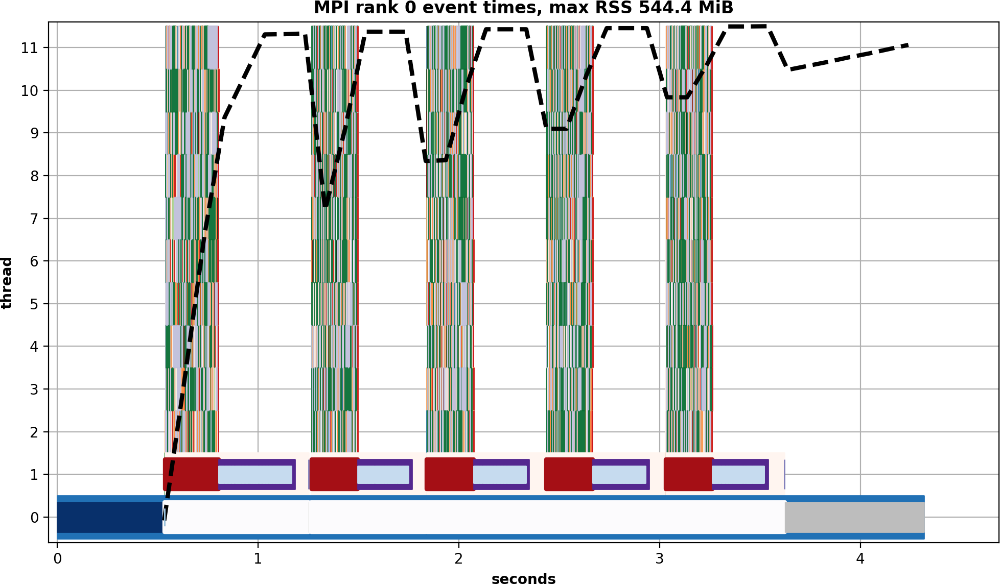

Development
===========
Testing
-------
TECA comes with an extensive regression test suite which can be used to validate
your build. The tests can be executed from the build directory with the ctest command.

.. code-block:: bash

   ctest --output-on-failure

Note that `PYTHONPATH`, `LD_LIBRARY_PATH` and `DYLD_LIBRARY_PATH` will need to
be set to include the build's lib directory and `PATH` will need to be set to
include ".".

Timing and Profiling
--------------------
TECA contains built in profiling mechanism which captures the run time
of each stage of a pipeline's execution and a sampling memory profiler.

The profiler records the times of user defined events and sample memory
at a user specified interval. The resulting data is written in parallel to
a CSV file in rank order. Times are stored in one file and memory use samples
in another. Each memory use sample includes the time it was taken, so that
memory use can be mapped back to corresponding events.

.. warning::
   In some cases TECA's built in profiling can negatively impact run time
   performance as the number of threads is increased. For that reason one should
   not use it in performance studies. However, it is well suited to debugging and
   diagnosing scaling issues and understanding control flow.

Compilation
~~~~~~~~~~~
The profiler is not built by default and must be compiled in by adding
`-DTECA_ENABLE_PROFILER=ON` to the CMake command line. Be sure to build in
release mode with `-DCMAKE_BUILD_TYPE=Release` and  also add `-DNDEBUG` to the
`CMAKE_CXX_FLAGS_RELEASE`. Once compiled the built in profilier may be enabled
at run time via environment variables described below or directly using its
API.

Runtime controls
~~~~~~~~~~~~~~~~
The profiler is activated by the following environment variables. Environmental
variables are parsed in `teca_profiler::initialize`. This should be
automatic in most cases as it's called from `teca_mpi_manager` which is used
by parallel TECA applications and tests.

+---------------------+---------------------------------------------------+
| Variable            | Description                                       |
+---------------------+---------------------------------------------------+
| PROFILER_ENABLE     | a binary mask that enables logging.               |
|                     | 0x01 -- event profiling enabled.                  |
|                     | 0x02 -- memory profiling enabled.                 |
+---------------------+---------------------------------------------------+
| PROFILER_LOG_FILE   | path to write timer log to                        |
+---------------------+---------------------------------------------------+
| MEMPROF_LOG_FILE    | path to write memory profiler log to              |
+---------------------+---------------------------------------------------+
| MEMPROF_INTERVAL    | float number of seconds between memory recordings |
+---------------------+---------------------------------------------------+

Visualization
~~~~~~~~~~~~~
The command line application `teca_profile_explorer` can be used to analyze the
log files. The application requires a timer profile file and a list of MPI
ranks to analyze be passed on the command line. Optionally a memory profile
file can be passed as well. For instance, the following command was used to
generate figure :numref:`prof_vis_10t_1r`.

.. code-block:: bash

   ./bin/teca_profile_explorer -e bin/test/test_bayesian_ar_detect \
      -m bin/test/test_bayesian_ar_detect_mem -r 0

When run the `teca_profile_explorer` creast an  interactive window displaying a
Gantt chart for each MPI rank.  The chart is organized with a row for each
thread. Threads with more events are displayed higher up. For each thread, and
every logged event, a colored rectangle is rendered. There can be 10's - 100's
of unique events per thread thus it is impractical to display a legend.
However, clicking on an event rectangle in the plot will result in all the data
associated with the event being printed in the terminal. If a memory profile is
passed on the command line the memory profile is normalized to the height of
the plot and shown on top of the event profile. The maximum memory use is added
to the title of the plot. Example output is shown in :numref:`prof_vis_10t_1r`.

.. _prof_vis_10t_1r:

   Visualization of TECA's run time profiler for the test_bayesian_ar_detect
   regression test, run with 1 MPI rank and 10 threads.

