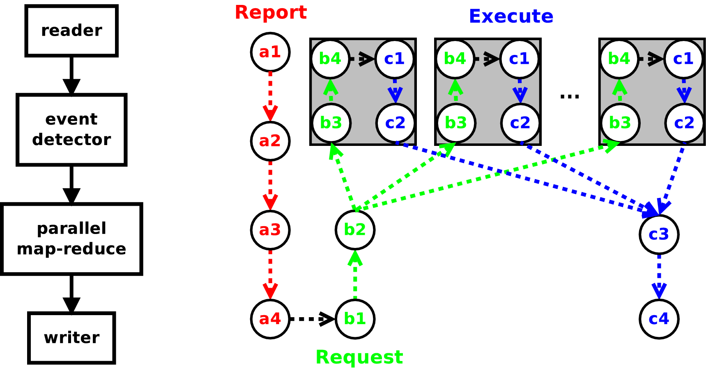

Python
======
TECA includes a diverse collection of I/O and analysis algorithms specific to
climate science and extreme event detection. It's pipeline design allows these
component algorithms to be quickly coupled together to construct complex data
processing and analysis pipelines with minimal effort. TECA is written
primarily in C++11 in order to deliver the highest possible performance and
scalability. However, for non-computer scientists c+11 development can be
intimidating, error prone, and time consuming. TECA's Python bindings offer a
more approachable path for custom application and algorithm development.

Python can be viewed as glue for connecting optimized C++11 components. Using
Python as glue gives one all of the convenience and flexibility of Python
scripting with all of the performance of the native C++11 code. TECA also
includes a path for fully Python based algorithm development where the
programmer provides Python callables that implement the desired analysis. In
this scenario the use of technologies such as NumPy provide reasonable
performance while allowing the programmer to focus on the algorithm itself
rather than the technical details of C++11 development.

.. _parallel_exec:

    execution path through a simple 4 stage pipeline on any given process in an
    MPI parallel run. Time progresses from a1 to c4 through the three execution
    phases report (a), request (b), and execute (c). The sequence of thread
    parallel execution is shown inside gray boxes, each path represents the
    processing of a single request.

.. _py_glue:

Pipeline Construction, Configuration and Execution
--------------------------------------------------
Building pipelines in TECA is as simple as creating and connecting TECA
algorithms together in the desired order. Data will flow and be processed
sequentially from the top of the pipeline to the bottom, and in parallel where
parallel algorithms are used. All algorithms are created by their static New()
method. The connections between algorithms are made by calling one algorithm's
set\_input\_connection() method with the return of another algorithm's
get\_output\_port() method. Arbitrarily branchy pipelines are supported. The
only limitation on pipeline complexity is that cycles are not allowed. Each
algorithm represents a stage in the pipeline and has a set of properties that
configure its run time behavior. Properties are accessed by set\_<prop
name>\(\) and get\_<prop name>\(\) methods. Once a pipeline is created and
configured it can be run by calling update() on its last algorithm.

.. _py_glue_code:

.. literalinclude:: source/stats.py
    :language: python
    :linenos:
    :caption: Command line application written in Python. The application constructs, configures, and executes a 4 stage pipeline that computes basic descriptive statistics over the entire lat-lon mesh for a set of variables passed on the command line. The statistic computations have been written in Python, and are shown in listing :numref:`py_devel_code`. When run in parallel, the map-reduce pattern is applied over the time steps in the input dataset. A graphical representation of the pipeline is shown in figure :numref:`parallel_exec`

For example, listing :numref:`py_glue_code` shows a command line application
written in Python. The application computes a set of descriptive statistics
over a list of arrays for each time step in the dataset. The results at each
time step are stored in a row of a table. teca\_table\_reduce is a map-reduce
implementation that processes time steps in parallel and reduces the tables
produced at each time step into a single result. One use potential use of this
code would be to compute a time series of average global temperature. The
application loads modules and initializes MPI (lines 1-4), parses the command
line options (lines 6-17),  constructs and configures the pipeline (lines
22-37), and finally executes the pipeline (line 39). The pipeline constructed
is shown in figure :numref:`parallel_exec` next to a time line of the
pipeline's parallel execution on an arbitrary MPI process.

.. _py_devel:

Algorithm Development
---------------------
While TECA is is written in C++11, it can be extended at run time using Python.
However, before we explain how this is done one must know a little about the
three phases of execution and what is expected to happen during each.

The heart of TECA's pipeline implementation is the teca\_algorithm. This is an
abstract class that contains all of the control and execution logic. All
pipelines in TECA are built by connecting concrete implementations of
teca\_algorithm together to form execution networks. TECA's pipeline model is
based on a report-request scheme that minimizes I/O and computation. The role
of reports are to make known to down stream consumers what data is available.
Requests then are used to pull only the data that is needed through the
pipeline. Requests enable subsetting and streaming of data and can be acted
upon in parallel and are used as keys in the pipeline's internal cache. The
pipeline has 3 phases of execution, report phase, the request phase, and
finally the execute phase.

Report Phase
++++++++++++
The report phase kicks off a pipeline's execution and is initiated when the
user calls update() or update\_metadata() on a teca\_algorithm. In the report
phase, starting at the top of the pipeline working sequentially down, each
algorithm examines the incoming report and generates outgoing report about what
it will produce. Implementing the report phase can be as simple as adding an
array name to the list of arrays or as complex as building metadata describing
a dataset on disk. The report phase should always be light and fast. In cases
where it is not, cache the report for re-use. Where metadata generation would
create a scalability issue, for instance parsing data on disk, the report
should be generated on rank 0 and broadcast to the other ranks.

Request Phase
+++++++++++++
The request phase begins when report the report phase
reaches the bottom of the pipeline. In the request phase, starting at the
bottom of the pipeline working sequentially up, each algorithm examines the
incoming request, and the report of what's available on its inputs, and from
this information generates a request for the data it will need during its
execution phase. Implementing the request phase can be as simple as adding a
list of arrays required to compute a derived quantity or as complex as
requesting data from multiple time steps for a temporal computation. The
returned requests are propagated up after mapping them round robin onto the
algorithm's inputs. Thus, it's possible to request data from each of the
algorithm's inputs and to make multiple requests per execution. Note that when
a threaded algorithm is in the pipeline, requests are dispatched by the thread
pool and request phase code must be thread safe.

Execute
+++++++
The execute phase begins when requests reach the top of the
pipeline. In the execute phase, starting at the top of the pipeline and working
sequentially down, each algorithm handles the incoming request, typically by
taking some action or generating data. The datasets passed into the execute
phase should never be modified. When a threaded algorithm is in the pipeline,
execute code must be thread safe.

In the TECA pipeline the report and request execution phases handle
communication in between various stages of the pipeline. The medium for these
exchanges of information is the teca\_metadata object, an associative
containers mapping strings(keys) to arrays(values). For the stages of a
pipeline to communicate all that is required is that they agree on a key naming
convention. This is both the strength and weakness of this approach. On the one
hand, it's trivial to extend by adding keys and arbitrarily complex information
may be exchanged. On the other hand, key naming conventions can't be easily
enforced leaving it up to developers to ensure that algorithms play nicely
together. In practice the majority of the metadata conventions are defined by
the reader. All algorithms sitting down stream must be aware of and adopt the
reader's metadata convention. For most use cases the reader will be TECA's
NetCDF CF 2.0 reader, teca\_cf\_reader. The convention adopted by the CF reader
are documented in its header file and in section \ref{sec:cf_reader}.

In C++ and Python polymorphism is used to provide customized behavior for each
of the three pipeline phases. In Python we use the teca\_python\_algorithm, an
adapter class that connects the user provided overrides such that they are
called at the appropriate times during each phase of pipeline execution. Hence
writing a TECA algorithm purely in Python amounts to providing three
appropriate overrides.

.. _py_devel_code:

.. literalinclude:: source/stats_callbacks.py
    :language: python
    :linenos:
    :caption: Overrides implementing the calculation of descriptive statistics over a set of variables laid out on a Cartesian lat-lon mesh. The request override requests the variables, the execute override makes the computations and constructs a table to store them in.

Python Algorithm Template
+++++++++++++++++++++++++
To extend TECA using Python one derives from teca_python_algorithm. A template
follows:

.. code-block:: python

    class YOUR_CLASS_NAME(teca_python_algorithm):

        # YOUR INITIALIZATION CODE

        # YOUR PROPERTY SETTING CODE

        def report(self, o_port, reports_in):
            # YOUR CODE REPORTING NEW DATA PRODUCED IN
            # EXECUTE.

        def request(self, o_port, reports_in, request_in):
            # YOUR CODE REQUESTING SPECIFIC DATA NEEDED
            # IN EXECUTE

        def execute(self, o_port, data_in, request_in):
            # YOUR CODE DO A CALCULATION, TRANSFORM DATA,
            # OR MAKING A SIDE AFFECT

One overrides one por more of the three methods: report, request, and execute.
In addition one can add initialization and properties that control run time
behavior. For instance a writer may use a file_name property to specify the
locatgion on disk to put the data. Typically this would be accessed via a
set_file_name method. The overrides are described in more detail below.

The Report Override
+++++++++++++++++++
The report override will report the universe of what the algorithm could produce.

.. code-block:: python

    def report(self, o_port, reports_in) -> report_out

o\_port
     integer. the output port number to report for. can be ignored for single
     output algorithms.

reports\_in
     teca\_metadata list. reports describing available data from the next
     upstream algorithm, one per input connection.

report\_out
     teca\_metadata. the report describing what you could potentially produce
     given the data described by reports\_in.

Report stage should be fast and light. Typically the incoming report
is passed through with metadata describing new data that could be produced
appended as needed. This allows upstream data producers to advertise their
capabilities.

The Request Override
++++++++++++++++++++
The request override generates an up stream request requesting the minimum
amount of data actually needed to fulfill the incoming request.

.. code-block:: python

    def request(self, o_port, reports_in, request_in) -> requests_out

o\_port
     integer. the output port number to report for. can be ignored for single output algorithms.

reports\_in
     teca\_metadata list. reports describing available data from the next
     upstream algorithm, one per input connection.

request\_in
     teca\_metadata. the request being made of you.

report\_out
     teca\_metadata list. requests describing data that you need to fulfill the
     request made of you.

Typically the incoming request is passed through appending the
necessary metadata as needed. This allows down stream data consumers to request
data that is produced upstream.

The Execute Override
++++++++++++++++++++
The execute override is where the computations or I/O necessary to produce the
requested data are handled.

.. code-block:: python

    def execute(self, o_port, data_in, request_in) -> data_out

o\_port
     integer. the output port number to report for. can be ignored for single
     output algorithms.

data\_in
     teca\_dataset list. a dataset for each request you made in the request
     override in the same order.

request\_in
     teca\_metadata. the request being made of you.

data\_out
     teca\_dataset. the dataset containing the requested data or the result of
     the requested action, if any.

A simple strategy for generating derived quantities having the same
data layout, for example on a Cartesian mesh or in a table, is to pass the
incoming data through appending the new arrays. This allows down stream data
consumers to receive data that is produced upstream. Because TECA caches data
it is important that incoming data is not modified, this convention enables
shallow copy of large data which saves memory.

Lines 25-27 of listing :numref:`py_glue_code` illustrate the use of
teca\_python\_algorithm. In this example a class derived from
teca\_python\_algorithm computes descriptive statistics over a set of variables
laid out on a Cartesian lat-lon mesh. The derived class, descriptive_stats, is
in a separate file, stats\_overrides.py (listing :numref:`py_devel_code`)
imported on line 4.

Listing :numref:`py_devel_code` shows the class derived from
teca\_python\_algorithm that is used in listing :numref:`py_glue_code`.  The
class implements request and execute overrides.  Note, that we did not need to
provide a report override as the default implementation, which passes the
report through was all that was needed. Our request override (lines 15-21 of
listing :numref:`py_devel_code`) simply adds the list of variables we need into
the incoming request which it then forwards up stream. The execute override
(lines 23-45) gets the input dataset (line 27), creates the output table adding
columns and values of time and time step (lines 29-31), then for each variable
we add columns to the table for each computation (line 35), get the array from
the input dataset (line 39), compute statistics and add them to the table
(lines 41-43), and returns the table containing the results (line 45). This
data can then be processed by the next stage in the pipeline.

.. _data_struct:

Working with TECA's Data Structures
~~~~~~~~~~~~~~~~~~~~~~~~~~~~~~~~~~~
Arrays
++++++
TODO: illustrate use of teca\_variant\_array, and role numpy plays

Metadata
++++++++
TOOD: illustrate use of teca\_metadata

The Python API for teca\_metadata models the standard Python dictionary.
Metadata objects are one of the few cases in TECA where stack based allocation
and deep copying are always used.

.. code-block:: python

    md = teca_metadata()
    md['name'] = 'Land Mask'
    md['bounds'] = [-90, 90, 0, 360]
    
    md2 = teca_metadata(md)
    md2['bounds'] =  [-20, 20, 0, 360]

Array Collections
+++++++++++++++++
TODO: illustrate teca\_array\_collection, tabular and mesh based datasets are implemented in terms of collections of arrays

Tables
++++++
TODO: illustrate use of teca\_table

Cartesian Meshes
++++++++++++++++
TODO: illustrate use of teca\_cartesian\_mesh

.. _cf_reader:

NetCDF CF Reader Metadata
~~~~~~~~~~~~~~~~~~~~~~~~~
TODO: document metadata conventions employed by the reader

